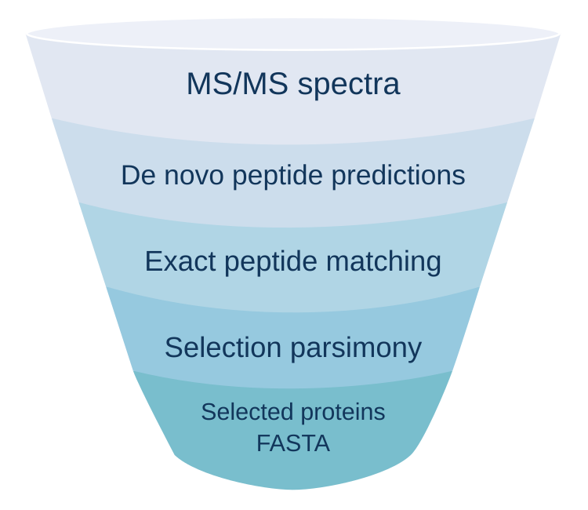

# FastaLake

[](https://github.com/MannLabs/fasta-lake/actions/workflows/ci.yml)
[](https://github.com/MannLabs/fasta-lake/actions/workflows/docker.yml)
[](https://mannlabs.github.io/fasta-lake/)
[](LICENSE)
[](docs/get-started/install.md#source-installation)

FastaLake uses de novo peptide evidence to construct compact protein databases
for proteomics and metaproteomics. Complete proteins are selected from large
sequence repositories for each mass spectrometry acquisition. The resulting
databases are searched with [Sage](https://github.com/lazear/sage), followed by
protein grouping and quantification within each study. Matched metagenomic and
metatranscriptomic sequences can be included when available.

<p align="center">
  
</p>

## Getting started

```bash
git clone https://github.com/MannLabs/fasta-lake.git
cd fasta-lake
bash tools/check_local_docker.sh docker_check_01
```

The first Docker build downloads dependencies and compiles the tools. The bundled examples then run offline. A successful check ends with `PASS`. See [the demo tour](docs/get-started/demo.md) and the [Docker guide](https://mannlabs.github.io/fasta-lake/get-started/docker/).

## Set up with an assistant

An agent or LLM can help you install FastaLake, prepare inputs and interpret a run.
Open this repository in your coding assistant and ask it to read [AGENTS.md](AGENTS.md),
then give it one of the [ready-to-copy task files](examples/assistant-tasks/README.md).
There are starting points for installation, your first study, matched DNA/RNA,
cluster jobs, troubleshooting and results. With a chat assistant that has no
terminal access, use the same files and run the checked commands yourself.

## Documentation guide

| You have | Start here |
|---|---|
| Example data | [Demo tour](docs/get-started/demo.md): every bundled example and what it produces |
| Your own spectra and de novo predictions | [First study](docs/get-started/first-study.md): acquisition manifest, preflight, result folders |
| Matched metagenome or metatranscriptome | [Molecular inputs](docs/how-to/molecular-inputs.md): one FASTA and one TPM table per specimen |
| A large reference and limited memory | [Compute choices and measured limits](docs/how-to/compute.md) |
| Help from an agent or LLM | [Assistant guide](docs/how-to/assistants.md): scheduler-first prompts for ChatGPT, Claude or a coding agent |
| Methods and interpretation | [How FastaLake works](docs/concepts/principle.md), then the [output contract](docs/concepts/output-contract.md) |

Source installation (Python 3.12 on Linux x86_64, hash-locked to the same package set as the container) is described under [source installation](docs/get-started/install.md#source-installation).

## How it is tested

Continuous integration runs the Rust crates, the Python suites, dependency and licence checks and the public CAMPI real-data example on every push, and the Docker workflow runs every bundled example offline. See [how it is tested](https://mannlabs.github.io/fasta-lake/#how-it-is-tested) and [validation](https://mannlabs.github.io/fasta-lake/concepts/validation/).

## Documentation

The full documentation is a searchable site at [mannlabs.github.io/fasta-lake](https://mannlabs.github.io/fasta-lake/), built from `docs/` on every push. To preview it locally:

```bash
pip install '.[docs]'
mkdocs serve
```

## Contributing and credits

The repository is organized by purpose:

| Folder | Contents |
|---|---|
| `fasta_lake/`, `rust/` | Python package and native engines |
| `examples/`, `demo/` | Runnable examples, including the optional [site template](examples/site/README.md) |
| `docs/` | Tutorials, concepts and reference documentation |
| `tests/`, `tools/` | Tests and development/workflow commands |
| `requirements/` | [Python dependency pins](requirements/README.md) |
| `release/` | [Release manifests and provenance](release/README.md) |
| `.github/` | CI workflows, contribution guidance and security policy |

[Contributing](.github/CONTRIBUTING.md) explains how to set up, test and submit a change. The [function map](docs/reference/function-map.md) connects every stage to its code and tests.

FastaLake uses [Sage](https://github.com/lazear/sage), [directLFQ](https://github.com/MannLabs/directlfq) and [AlphaPeptTools](https://github.com/MannLabs/alphapepttools). Please credit them alongside the FastaLake revision and settings. [AlphaPept](https://github.com/MannLabs/alphapept) inspired the emphasis on readable functions. Code is under the [MIT licence](LICENSE). Bundled data and third-party dependencies keep their own terms. A manuscript is in preparation. Cite the repository revision until a DOI exists ([CITATION.cff](CITATION.cff)).

## AI-assisted development

Much of FastaLake's code and documentation was developed with Codex Astra
(reasoning effort: xhigh), Opus 4.8, Opus 5 and Fable. The authors remain
responsible for the software, design decisions, validation and scientific
claims. AI assistance is not evidence that an implementation is correct.
The [validation documentation](docs/concepts/validation.md) describes the checks
and their limits.
