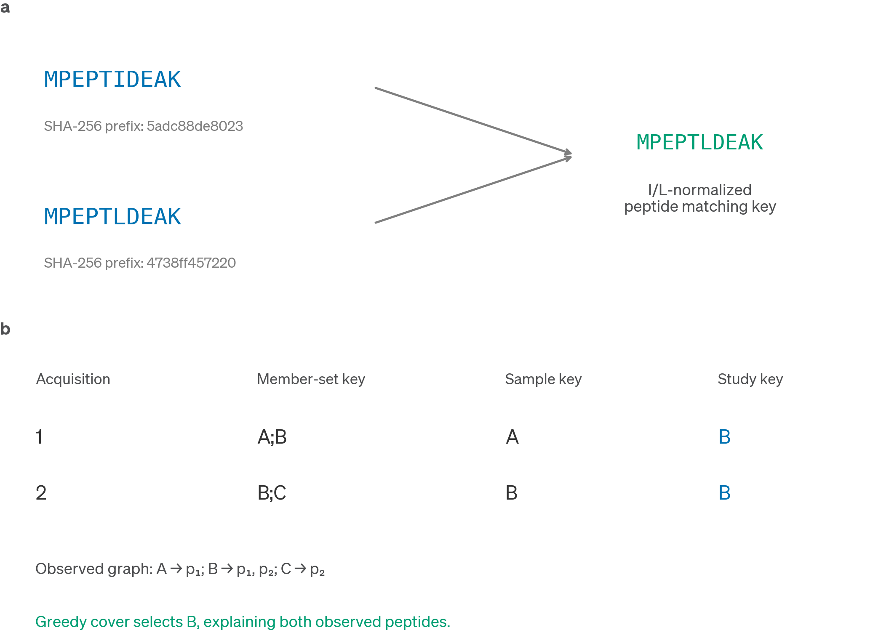
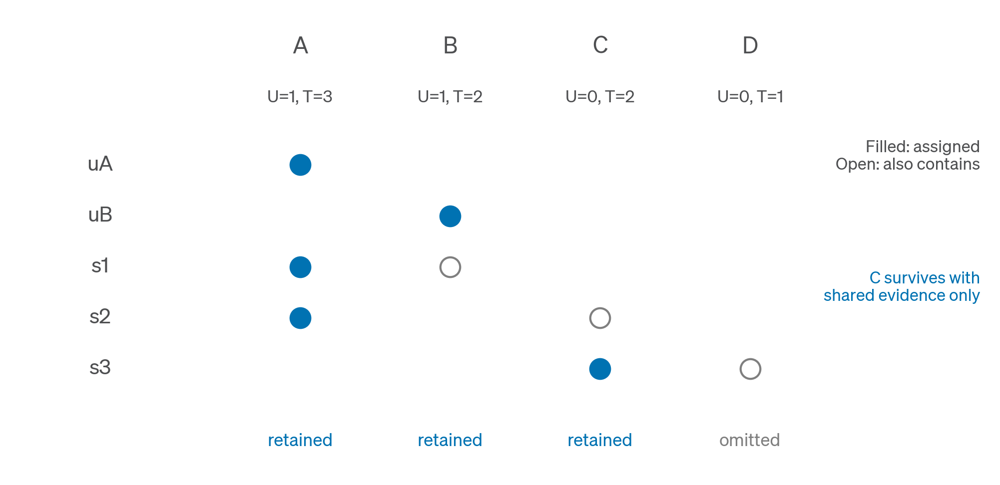

# Algorithms, identity and protein inference

## The objects the workflow manipulates

FastaLake operates on a reference sequence universe, peptide evidence and the relations between those objects. A FASTA record has an accession, a sequence and descriptive provenance. A prediction row has a peptide sequence and a score. A mapping edge means that the normalized peptide occurs as a contiguous substring of the normalized protein sequence. An edge does not assert that the peptide was correctly predicted or that the protein was present.

Write \(R\) for the reference protein sequences, \(E_s\) for the extraction peptides of acquisition \(s\), and \(M(p)\) for the proteins containing peptide \(p\) under the matching rule. The evidence lake contains the union of \(M(p)\) across the declared acquisitions. The acquisition-specific drawn database contains the union of \(M(p)\) for that acquisition's extraction peptides, restricted to the evidence lake. When the pooled and per-acquisition stages use exactly the same evidence policy and no intervening transformation, this two-stage containment is equivalent to drawing each acquisition directly from \(R\). The pooled stage avoids repeated scans of the full reference.

Inference uses a second evidence collection, \(I_s\), obtained without the top-fraction extraction argument. Its mapped peptides can distinguish proteins that the high-ranked construction evidence alone could not. This is a deliberate difference between two operations. Both evidence collections come from the same acquisition, so the distinction does not create an independent validation dataset.

## Four identity and counting rules

| Object | Canonical representation | What equality means | What equality does not establish |
|---|---|---|---|
| Protein sequence identity | SHA-256 of normalized sequence bytes | The same normalized amino-acid sequence | Same source organism, gene locus or biological molecule |
| Peptide comparison identity | Unmodified sequence with I replaced by L | Same sequence under the stated comparison convention | Same modification, charge, spectrum or genomic origin |
| Protein-member-set key | Sorted, deduplicated matching accessions joined with semicolons | The same reported accession set | A uniquely identified protein or an inferred minimal group |
| Study reporting key | Representative selected from a declared pooled evidence graph | Membership under that study's grouping rule | A universal group identity or recalibrated group-level FDR |

### Sequence hashes preserve a reference identity

The hashing contract keeps ASCII letters, converts lowercase to uppercase, and discards nonletters. SHA-256 is applied to those normalized bytes and written as 64 lowercase hexadecimal characters. The hash contract is versioned independently of the package version, because changing the normalization changes the identity system.

For example, `ac d*E` normalizes to `ACDE`. Hashing therefore ignores case, spacing and the stop marker. The normalization removes an internal stop marker rather than splitting the record. A source FASTA containing internal stops must be inspected before pooling, because normalization cannot establish whether the concatenated residues describe a real protein. Ambiguity letters such as X and B remain literal rather than expanding to possible residues.

Isoleucine and leucine remain different in the stored sequence and in the sequence hash. `PEPTIDEAK` and `PEPTLDEAK` therefore have different sequence identities, although both become `PEPTLDEAK` for I/L-insensitive peptide matching. This separation preserves reference sequence variation while respecting the matching convention used for the mass-spectrometric evidence.

The source-header table supplies the many-to-one relation between catalogue records and a deduplicated sequence. A single sequence can occur in several organisms or catalogues. The hash does not encode taxonomy, abundance, functional annotation or which source record is biologically correct. Report an unmapped source as unknown rather than classifying it as microbial by exclusion.

SHA-256 collisions are a theoretical property of a finite digest; accidental collisions are negligible at this application scale. The more immediate risks are changes in the normalization contract, corrupted inputs, and an old accession system used with a new sidecar. Version and checksum the FASTA and sidecar together.

### Peptide identities depend on the question

A spectrum match, a modified peptide, an unmodified peptide and an I/L-canonical peptide are different counting units. Two spectra can identify the same peptide. Two charge states can quantify the same peptide. Methionine oxidation can create a distinct measured feature that collapses into the same unmodified sequence in a sequence-level overlap analysis.

The acceptance analysis removes bracketed modification annotations and replaces I with L when counting canonical peptides. It sums accepted positive feature intensities when reporting peptide-level signal. It does not claim to estimate modification occupancy from that sum. Retain the raw search and LFQ tables whenever a later analysis may require charge or modification resolution.

### A protein-member-set key is a relation, not an inference

Suppose the engine reports `B;A;B` for a peptide. Sorting and deduplicating yields the member-set key `A;B`. A different peptide reported as `B;C` has key `B;C`. These are two distinct keys, even though both contain B.

Now suppose one acquisition searches A and B, whereas another searches B and C. The same peptide may receive `A;B` in the first acquisition and `B;C` in the second. The key changed because the set of available sequence explanations changed. Counting each distinct set across a cohort as a distinct biological protein would confuse a reporting relation with the underlying entity.

The lexical sample key takes the smallest accession in a member set, so `A;B` becomes A and `B;C` becomes B. This gives a deterministic table label but performs no peptide-coverage optimization. It also loses information if the full member set is not retained elsewhere. On this branch, the study utility retains full local memberships in a feature ledger; the lexical sample key does not partition its quantitative table.

Figure 1. Sequence hashing, I/L-normalized peptide comparison and study grouping establish different equivalence relations. Two source sequences can share a matching peptide without sharing a sequence hash. A study representative is chosen from a declared evidence graph, not by interpreting the spelling of a member-set label.

## Evidence selection and exact containment

### Ranking and deduplication

For each acquisition, the extractor first constructs the eligible prediction rows. Eligibility requires the requested length range, a positive finite score, and the low-complexity filters documented in the user guide. Scores are ranked in descending order. If the requested fraction is \(f\) and there are \(n\) eligible rows, the score at rank \(\lceil f \cdot n \rceil\) supplies the threshold. All rows at or above that score are retained.

For scores 0.99, 0.95, 0.95, 0.80 and 0.60 with \(f = 0.40\), rank two has score 0.95. Three rows survive because the second and third rows tie. The retained row fraction is 60%, although the requested rank fraction is 40%. This behavior avoids treating exactly tied scores differently.

Repeated prediction rows remain part of the rank distribution before the final peptide set is deduplicated. A frequently repeated high-scoring sequence can therefore affect the cutoff. The rule is not equivalent to ranking distinct peptides by their best score. Changing to that alternative would require a new parameter definition and an empirical sensitivity analysis.

The parameter named `--top-percent` in the Rust executable accepts a fraction: 0.30 means 30%. The portable runner calls it `--top-fraction` to make the units explicit. Values such as 30, NaN and infinity are rejected. The prediction score is used for rank selection here; it is not interpreted as a calibrated probability that the selected protein is present.

### Why Aho-Corasick is appropriate

Aho-Corasick constructs an automaton from many peptide patterns and scans a protein sequence for all patterns in one traversal. For a fixed automaton, scan work scales with the residues traversed plus the reported matches, rather than requiring a separate full scan for every peptide. Automaton construction depends on the total pattern length and the implementation's representation. At reference scale, dense matching and memory traffic can dominate practical runtime.

FastaLake asks for exact substring containment after I/L normalization. This is not a sequence alignment; it introduces no substitution matrix, gap penalty or homology threshold. A peptide with a substitution may fail to retrieve its true protein, whereas a wrong short peptide may occur by chance in an unrelated protein. Longer evidence generally reduces chance containment but risks loss where de novo accuracy declines with length. The chosen length window is therefore a design parameter, not a universal optimum.

The implementation scans the sequence lake and retains proteins with at least one match. It does not enforce tryptic boundaries at this construction step. Enzyme specificity belongs to the later SAGE search configuration. Construction evidence and searchable peptides consequently have different admissibility rules.

The algorithmic source is Aho and Corasick, *Efficient string matching: an aid to bibliographic search*, Communications of the ACM 18, 333–340 (1975), [doi:10.1145/360825.360855](https://doi.org/10.1145/360825.360855). The FastaLake rules above describe this code's use of exact multi-pattern matching.

## The implemented Rust razor rule

Construct a bipartite graph between the mapped evidence peptides and the proteins in the drawn database. Each edge records containment. Deduplicate the evidence peptides so that repeated rows do not create extra unique-peptide counts. For each protein \(v\), define \(U(v)\) as the number of its mapped peptides with degree one and \(T(v)\) as its total number of distinct mapped peptides.

For each peptide \(p\), choose a protein from \(M(p)\) by the following ordered rule:

1. Prefer the largest \(U(v)\).
2. Among those proteins, prefer the largest \(T(v)\).
3. Resolve any remaining tie using the explicitly selected tie rule.

The validated workflow uses `hash-acc`: compute 64-bit FNV-1a on the accession bytes, prefer the smallest value, and use lexical accession order for a residual hash collision. This hash is a deterministic ordering device. It is distinct from the SHA-256 hash that identifies a protein sequence.

The evidence counts \(U\) and \(T\) are computed from the full mapped graph before assignment. They are not updated as peptides are assigned under hash-acc. The selected database is the set of proteins receiving at least one assignment. Every mapped peptide has an explaining selected protein, but the algorithm does not search all protein subsets for the smallest one.

!!! example "Worked example: a protein supported only by shared peptides survives"

    Use the following containment graph. The names identify distinct peptide sequences rather than spectra or intensities.

    | Protein | Mapped peptides | Unique peptides \(U\) | Total peptides \(T\) |
    |---|---|---:|---:|
    | A | uA, s1, s2 | 1 | 3 |
    | B | uB, s1 | 1 | 2 |
    | C | s2, s3 | 0 | 2 |
    | D | s3 | 0 | 1 |

    The unique peptide uA goes to A and uB goes to B. Shared peptide s1 can be explained by A or B. Their unique counts tie at one, so A wins on total mapped peptides, three versus two. Shared peptide s2 can be explained by A or C. A wins on unique evidence, one versus zero. Shared peptide s3 can be explained by C or D. Both have zero unique peptides, so C wins on total evidence, two versus one.

    The final assignments are A = {uA, s1, s2}, B = {uB}, and C = {s3}. A, B and C survive. D does not. C has no unique peptide in the input graph, yet it survives because it receives shared evidence. The valid general statement is that a protein is retained if it receives at least one assignment under the rule. A unique peptide guarantees an assignment to its sole explaining protein, but unique evidence is not required for survival.

    This distinction matters when defending a parsimony schematic. A diagram in which one particular protein with no unique peptide is dropped can be correct. Generalizing that example to all shared-only proteins would be incorrect.

    

    Figure 2. Filled circles indicate assigned evidence and open circles indicate additional containment. C receives s3 despite having no unique peptide. D receives no assignment. \(U\) and \(T\) denote unique and total mapped peptide counts.

!!! example "Worked example: fully tied proteins remain biologically unresolved"

    Suppose A and B each contain \(p_1\) and \(p_2\), with no other mapped evidence. Then \(U(A) = U(B) = 0\) and \(T(A) = T(B) = 2\). Hash-acc gives one fixed ordering for A and B, and both peptides are assigned to the same winning accession. One representative is selected.

    The output is deterministic, but the evidence does not distinguish A from B. Repeated execution returning A does not make A more probable biologically. Changing an accession can change the residual tie ordering even when the peptide graph is unchanged. A common sequence-hash accession scheme and an explicit tie rule reduce arbitrary between-run differences, while the member-set relation preserves the unresolved alternatives.

    An accession-only tie rule also differs from hashing the peptide-accession pair. Pair hashing can choose A for \(p_1\) and B for \(p_2\), retaining both equivalent proteins. That can increase database size and apparent source diversity without adding discriminating evidence. The two algorithms answer different design objectives and must not share an unqualified Methods label.

!!! example "Worked example: razor is not minimum set cover"

    Consider \(A = \{p_1, p_2, p_3, p_4\}\), \(B = \{p_1, p_2, p_5\}\), \(C = \{p_3, p_4, p_6\}\) and \(D = \{p_5, p_6\}\). Every peptide is shared, so all unique counts are zero. A has four mapped peptides, B and C have three, and D has two.

    The razor rule assigns \(p_1\) through \(p_4\) to A, \(p_5\) to B and \(p_6\) to C. It retains three proteins: A, B and C. Yet A and D together explain all six peptides, as do B and C. A minimum cover therefore needs only two proteins. The example establishes directly that this razor rule does not solve the minimum-cardinality optimization problem.

    The useful guarantee is coverage under an explicit evidence preference, not global minimality. The design favors proteins with unique and extensive mapped support before applying an arbitrary residual tie rule. A smaller solution can exist without being the one preferred by those priorities.

### Why the Python and Rust interfaces are labelled separately

The repository retains experimental Python inference strategies. Python razor uses a different evidence weighting and tie behavior from the validated Rust razor/hash-acc path. Its command historically defaults to a species-budget strategy. FastaLake warns explicitly that this interface differs from the tutorial workflow.

A shared strategy name is insufficient evidence of numerical equivalence. Methods must state implementation, strategy, tie rule, evidence collection and normalization. The acceptance experiment uses the Rust executable throughout. Species-budget, uniform, Bayesian and rescue modes require separate explanations and validation when selected.

## Post-search study grouping

### Declare the universe before grouping

For a completed study, let \(S\) be the union of accessions in the exact FASTAs searched. Build an observed graph from the target search rows passing the declared peptide-q threshold. Peptides are canonicalized for this analysis by removing bracket annotations and replacing I with L. Proteins with no observed passing peptide remain members of the searched universe but receive no evidence-derived study key.

This restriction prevents an unsearched catalogue protein from entering the reporting dictionary merely because it could explain a peptide in theory. It also makes the denominator explicit. A searched protein is an available hypothesis, whereas an observed graph node has at least one accepted peptide relation. Neither label alone proves a unique biological protein identification.

### Greedy set cover, step by step

Start with no peptides covered. Select the protein that explains the largest number of currently uncovered peptides. Resolve equal gains by lexical accession order. Mark its peptides covered and repeat until every observed peptide is covered. The implementation uses a lazy priority queue to update gains without recomputing every protein's gain at each step.

For \(A = \{p_1, p_2\}\), \(B = \{p_2, p_3\}\) and \(C = \{p_3\}\), A and B share the maximum initial gain of two. Lexical order selects A first and covers \(p_1\) and \(p_2\). B and C then each add \(p_3\). B wins the lexical tie and the selected order is A, B. The incremental gains are two and one.

The selected order supplies a rank. Each peptide is assigned to the first selected representative containing it. Every eligible LFQ feature follows that peptide assignment directly. Nonselected proteins are retained as local candidates in the feature ledger; they are not forced into one whole-protein reporting group. Each assigned peptide must occur in its representative sequence, with I/L equivalent.

This procedure differs from pre-search razor in its input, objective and tie rule. It uses database-search observations pooled across acquisitions, chooses maximum additional coverage, and is applied after identification. It cannot change which spectra were searched or establish a new study-level FDR threshold.

!!! example "Worked example: harmonizing changing member sets"

    Suppose \(p_1\) maps to A and B, while \(p_2\) maps to B and C. Across the study, A explains \(\{p_1\}\), B explains \(\{p_1, p_2\}\), and C explains \(\{p_2\}\). Greedy cover selects B with gain two and finishes. Both peptides receive study key B. A and C remain alternative candidate proteins; the shared peptide evidence is reported under B.

    An acquisition containing only \(p_1\) contributes to B, and another containing only \(p_2\) also contributes to B. Their different local memberships, A;B and B;C, remain in the feature ledger. There is one quantitative study-group table, without a separate lexical sample-key partition.

    Adding a new acquisition can change the graph and the selected representative order. Study keys should therefore be accompanied by a dictionary checksum and a cohort definition. To compare a future acquisition with a fixed reference study, either apply a frozen mapping with an explicit unknown category, or rebuild the dictionary and version the resulting key changes.

### Greedy cover also has limits

Greedy cover is deterministic under its tie rule but is not an exact solver. For \(A = \{p_1, p_2, p_3, p_4\}\), \(B = \{p_1, p_2, p_5\}\) and \(C = \{p_3, p_4, p_6\}\), greedy first chooses A with four peptides. It then needs B for \(p_5\) and C for \(p_6\), retaining three proteins. B and C alone cover all six peptides, so the optimum is two.

A selected representative's group is a reporting construct over observed evidence. Direct peptide assignment ensures sequence compatibility but does not prove the unique homolog or organism of origin. A pooled representative may be absent from the contributing acquisition's search FASTA; the feature ledger flags this explicitly.

The original whole-protein plurality detour could assign a feature to a representative lacking its peptide. The current release removes that detour. The worked failure case and HSTOOL comparison (in the private review record, not part of this repository) describe the measured consequences and the remaining annotation uncertainty.

## Confidence filtering precedes summation

Let \(x_i\) be an observation intensity, \(q_i\) the confidence value used by a specific matrix, and \(k_i\) its reporting key. At threshold \(t\), the intended group intensity is the sum of \(x_i\) over observations satisfying \(k_i = k\) and \(q_i \le t\), with all other inclusion rules also applied. Filtering after summing creates a different quantity.

For two observations with the same key, take \(x = 10\) and \(1{,}000\), with \(q = 0.001\) and \(0.9\) respectively. At \(t = 0.01\), the correct contribution is 10. An earlier implementation first summed to 1,010 and then let the group pass because one observation had a low q-value. FastaLake filters the observations before adding their intensities.

The same logic applies when repeated spectra or peptide features share a key. A high-confidence observation cannot confer its confidence on another observation merely because their labels match. Each table must specify whether \(q\) refers to a spectrum, peptide, protein or MS1 integration. Those are different hypotheses and counting levels.

In the 30 acceptance searches, the old and corrected 1% LFQ matrices were numerically identical. This empirical result bounds the observed impact for those files. The synthetic regression remains necessary because custom tables or other datasets can contain the triggering configuration.

## Determinism, reproducibility and scientific validity

Determinism means that the same supported inputs and explicit rules produce the same output. Reproducibility additionally requires enough information to reconstruct those inputs and rules, including the searched FASTA, executable, settings and grouping dictionary. Scientific validity requires that the design and assumptions support the biological or statistical claim.

A deterministic tie rule can reproducibly select an unresolved representative. A byte-identical FASTA can be generated from incorrectly paired input files. A nominal q-value can be calculated consistently while a separate adaptive-selection assumption remains untested. Each of these statements can hold simultaneously.

The release validation therefore combines boundary tests, cross-language identity checks, real acquisition runs, retained provenance and explicit limits. For a defence, state the algorithm's guarantee first, show the corresponding example, and then name the nearby claim that the guarantee does not establish.
