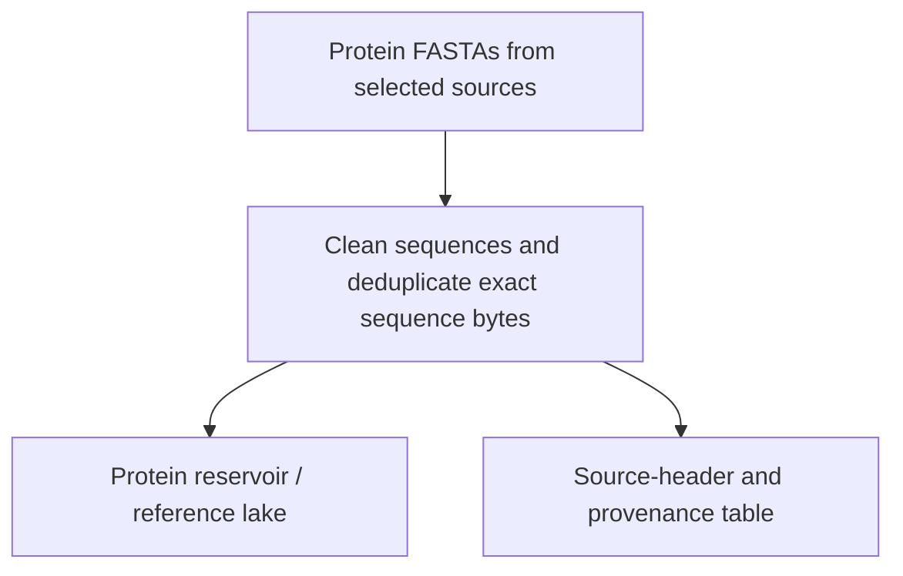
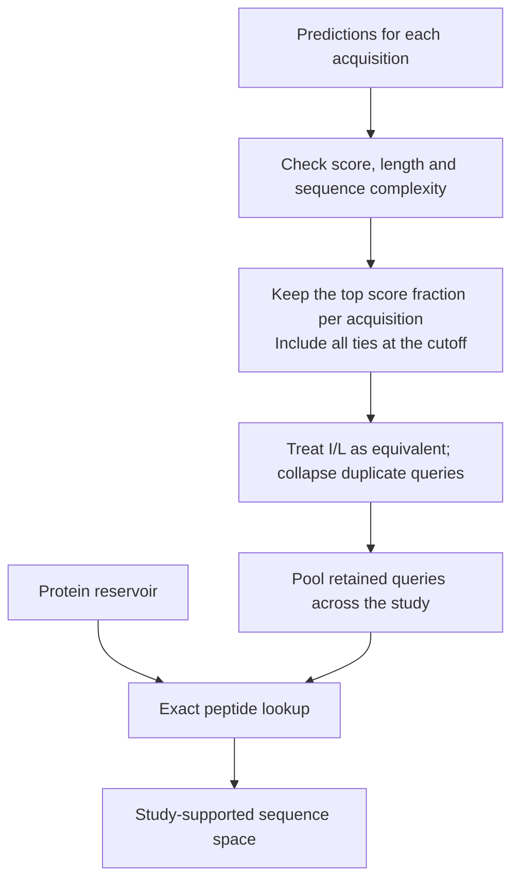
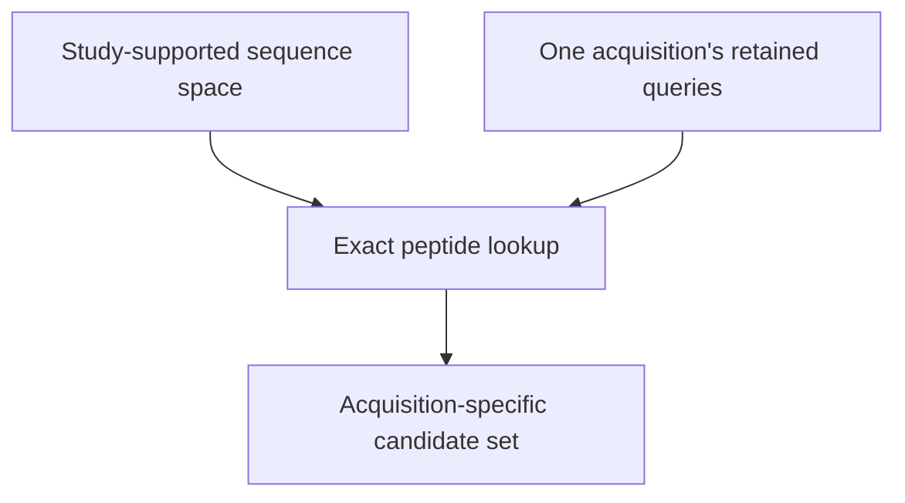
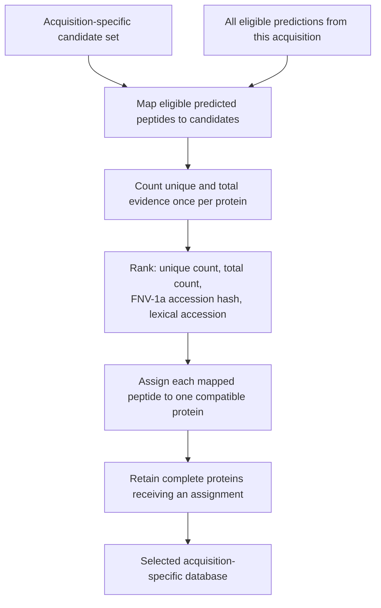
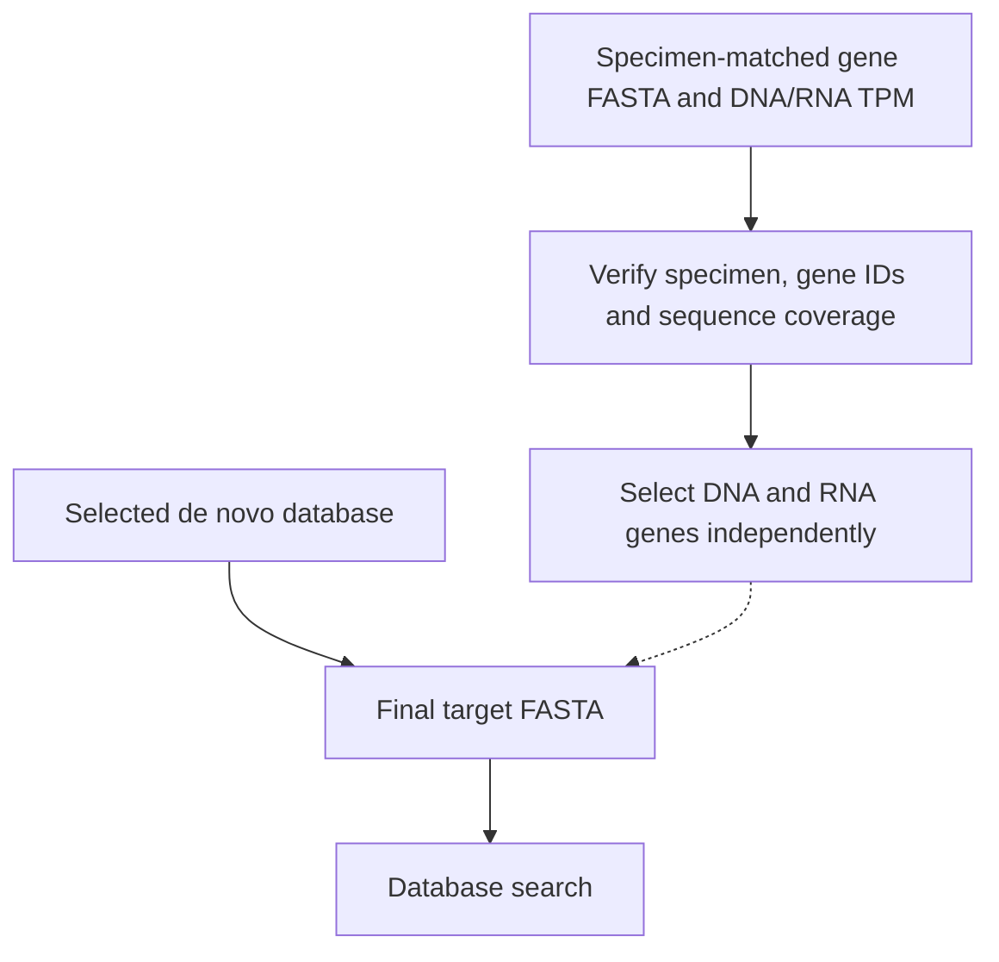
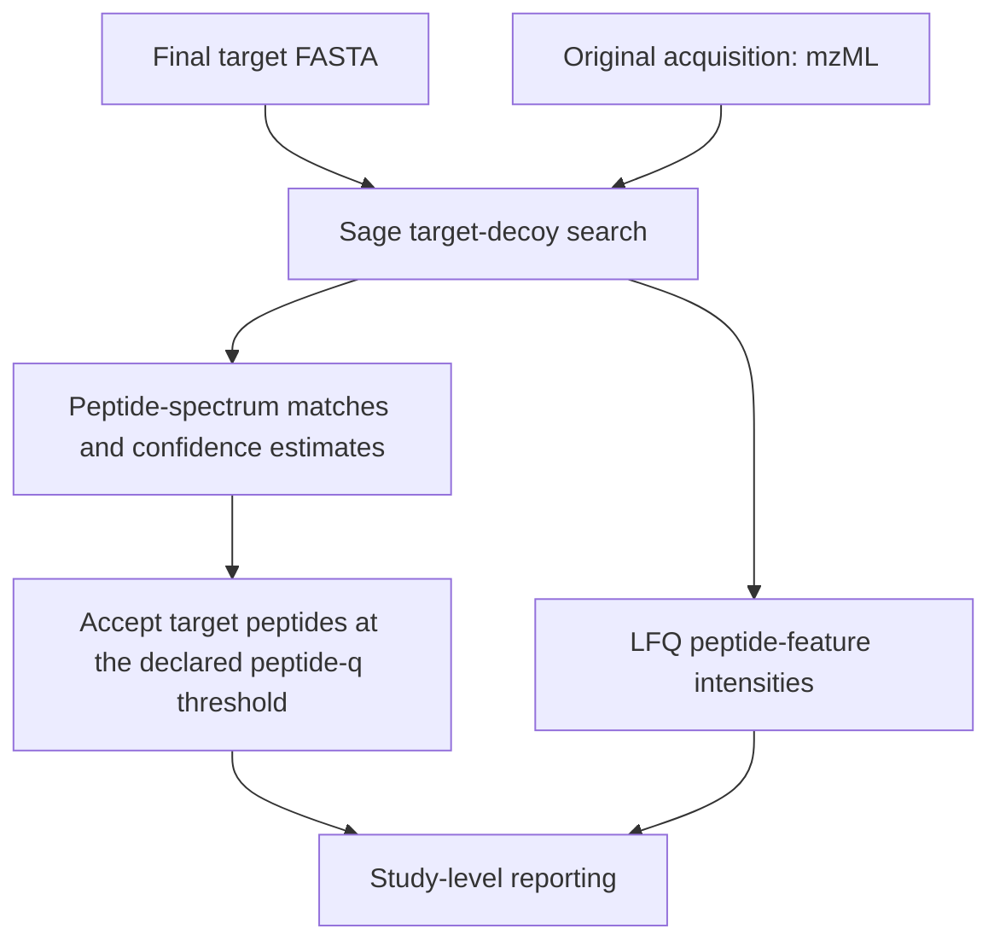
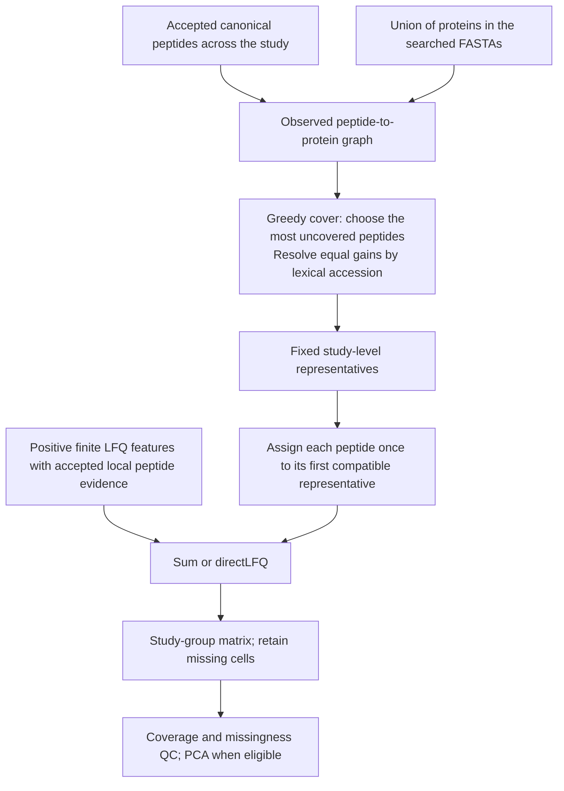
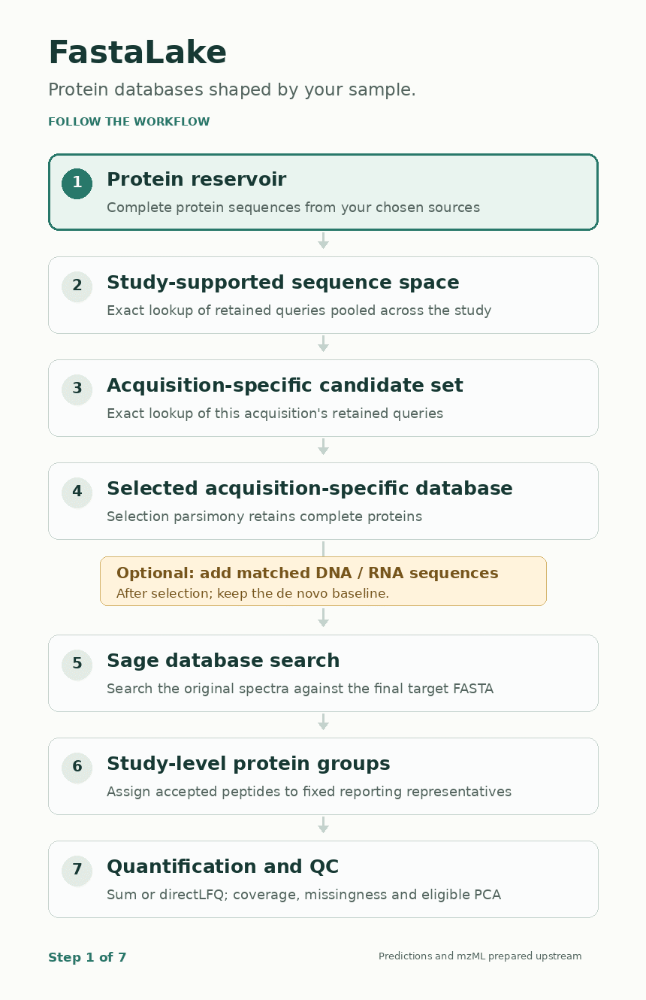

# From spectra to a study

FastaLake first chooses which complete protein sequences to search. It then
searches the measured spectra and organizes accepted peptide evidence across
your study. Here is what changes at each step.

Conversion to mzML and de novo sequencing happen upstream. Bring a prepared
protein reservoir, predictions and one mzML per acquisition.

## 1. Prepare the protein reservoir

Pool the protein sequences you want to make searchable. Exact duplicates can
share one stored record while their source headers remain available.
The standard workflow applies no additional similarity clustering.

Start with [choosing references](../how-to/references.md) and
[building a lake](../how-to/build-a-lake.md).
Protein hashes preserve I and L; peptide matching treats them as equivalent.

## 2. Find the study-supported sequence space

Filter and rank predictions within each acquisition, then pool the retained
queries. Exact substring lookup keeps reservoir proteins containing at least
one query. The result is called `evidence.fasta`.

With fraction *f* and *n* eligible rows, the score at rank ⌈*f* × *n*⌉ defines
the cutoff. Ties may retain more than *f* of the rows. Standard lookup uses the
top 30% of eligible rows, lengths 9–50 and positive finite scores.
Low-complexity filtering happens before I/L collapse; the
[algorithm guide](algorithms.md) gives the exact rules.

## 3. Retrieve candidates for one acquisition

Query the study-supported space with that acquisition's own retained peptides.
A protein does not enter its candidate set simply because another acquisition
retrieved it.

With the same query policy and no intervening transformation, this returns the
same candidates as querying the full reservoir directly. The pooled step saves
repeated scans of the larger collection.

## 4. Select a compact database

Selection parsimony maps all eligible predictions from the acquisition onto
its candidates, including eligible predictions below the top-30% lookup cutoff.
Each distinct I/L-equivalent evidence sequence counts once.

Counts stay fixed during assignment. Shared peptides can retain a protein,
so selection supports a searchable sequence without proving a unique protein
identity. This rule does not guarantee a minimum set cover.
See the [worked razor example](algorithms.md).

## 5. Add matched molecular evidence, when available

The de novo database can go straight to search. If matched DNA/RNA measurements
are available, their supported exact protein sequences can be added after
selection, retaining the baseline sequences and headers.

Missing measurements supply no support. Molecular evidence nominates candidates;
the spectra still determine search acceptance.
[Prepare matched molecular inputs](../how-to/molecular-inputs.md).

## 6. Search the original spectra

Sage searches the final target FASTA against the acquisition's mzML.
The search configuration records digestion, modifications, tolerances and
confidence settings.

The standard search allows 5–50-residue peptides. The nine-residue minimum for
de novo lookup is a separate setting. Complete proteins make additional
peptides available to the search.
[Choose search settings](../how-to/search-settings.md).

## 7. Group, quantify and inspect the study

Pool accepted peptide evidence across the declared acquisitions, using only
proteins from the FASTAs actually searched. Build a fixed reporting dictionary,
then assign each peptide to its first selected compatible representative.

Selection parsimony uses predicted evidence and fixed counts. Post-search greedy
cover uses accepted evidence and updates uncovered-peptide counts. Group labels
are stable within the resulting dictionary; they do not establish unique
protein or species origin.

Start with [reading results](../how-to/read-outputs.md), then
[quantification](../how-to/quantification.md) and
[downstream analysis](../how-to/downstream-analysis.md).
Taxonomy and functional annotation are [optional follow-up analyses](../how-to/taxonomy.md).
Search q values and grouping do not by themselves establish
[whole-workflow error control](error-control.md).

??? info "Animated overview"
    { .no-lightbox }

    [Static overview](../assets/workflow.png).
