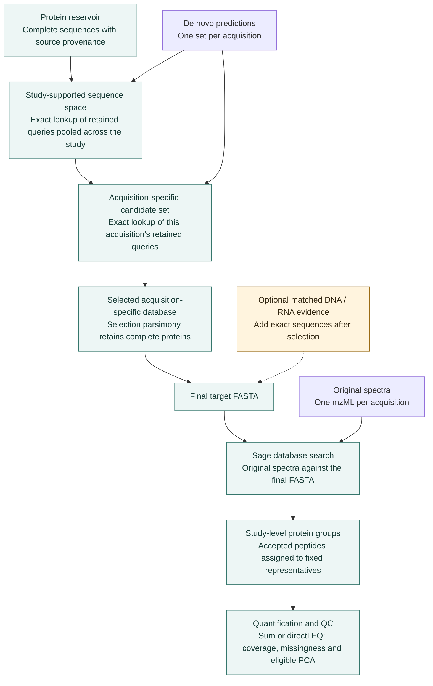

# The principle behind FastaLake

De novo sequencing predicts peptide sequences directly from spectra, without
matching them to a protein reference. FastaLake uses those predictions to select
complete proteins from a broad reference catalogue, then searches the measured spectra with Sage. This
keeps the search space manageable and preserves a record of how each
candidate entered it. Because the selected database contains whole proteins,
Sage can identify additional peptides beyond the predictions used for selection.
Recovery still depends on which sequences the reference contains.

## How the workflow connects

- **Evidence selection** first reduces the reference using the study's predictions,
  then narrows candidates for each acquisition. Reference pieces merge before
  inference; each piece uses the same prediction-ranking rules.
- **Razor selection** assigns mapped peptides using the declared deterministic
  rule and retains proteins receiving an assignment.
- **Sage searching** evaluates the final candidates against measured spectra with
  explicit digestion, modification and confidence settings.
- **Study reporting** connects accepted peptide evidence to fixed reporting
  groups, quantities and QC. The exported ledgers retain local protein memberships.

The [algorithm guide](algorithms.md) specifies thresholds and tie rules;
the [function map](../reference/function-map.md) links the code and tests behind each stage.

## Names used in the results

The [glossary](terminology.md) defines each sequence space and connects it to the
actual file or command name. The [illustrated workflow](pipeline-stages.md)
shows how the spaces change, step by step.

## How multi-omics adds evidence

Matched DNA and RNA select genes independently within a specimen-qualified
reference. Their exact protein sequences are added after razor and before
Sage, preserving every de novo baseline protein and header. Optional metabolite
links provide another explicit selection route. These inputs nominate candidates;
they do not themselves establish protein detection, reaction flux or organism of
origin. The [molecular tutorial](../how-to/molecular-inputs.md) explains preparation and provenance.

## Interpretation and practical scope

Shared peptides can leave biological origin ambiguous. A representative accession
is therefore not automatically a unique protein or species identification.
Likewise, a blank quantity is not evidence of absence. Adding candidates may gain
some search identifications and lose others. Retaining baseline sequences does
not guarantee identical search acceptance.

Database selection uses study evidence, so a nominal search q-value does not alone
calibrate the whole adaptive procedure. The scientific evidence record is kept with the private review record (not part of this repository).

Clusters remain valuable for large references, broad searches and sustained
cohort processing. Chunking reduces extraction memory but does not bound every
stage. Use the [measured resource guide](../how-to/compute.md) to choose an execution
environment, and the [Docker tutorial](../get-started/first-study.md) to run the same workflow locally.
