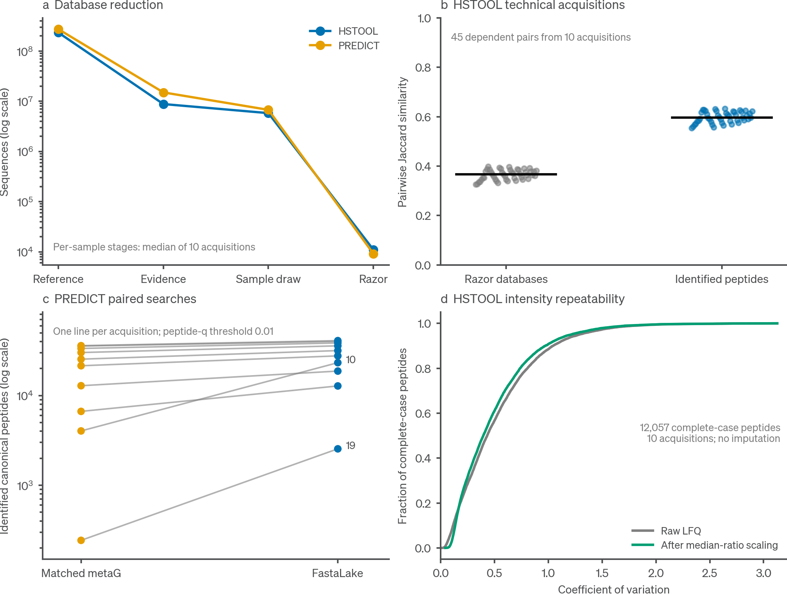

# Empirical validation and interpretation

## Study design

The acceptance experiment included ten HSTOOL acquisitions labelled TechnicalReplicates 1–10 and ten PREDICT acquisitions with matched metagenome FASTAs. Each acquisition was processed through pooled evidence extraction, acquisition-specific extraction, Rust razor/hash-acc selection and SAGE searching. The PREDICT acquisitions were also searched against their matched metagenome FASTAs, giving thirty completed searches. Existing predictions and mzML files were reused.

The manifest was selected before comparing outcomes. The PREDICT subset corresponds to MicrobPred 10–19. The HSTOOL design labels come from retained acquisition metadata. The exact preparation and injection relationships should be confirmed before interpreting the variance as a specific experimental component. The ten-acquisition evidence pool couples the construction context across runs, so this experiment does not establish generalization to an unseen cohort.

## Main measurements

| Measurement | Observed result | Interpretation |
|---|---:|---|
| Completed FastaLake acquisitions | 20 of 20 | Successful execution on the declared inputs |
| Completed matched-metagenome searches | 10 of 10 | Includes a documented memory retry |
| HSTOOL identified canonical peptides per acquisition | 30,570–31,788 | Target peptide_q ≤ 0.01, modifications removed, I/L collapsed |
| Median HSTOOL database Jaccard | 0.3661 | Exact selected accession sets |
| Median HSTOOL peptide Jaccard | 0.5969 | Identified canonical peptide sets |
| HSTOOL complete-case peptides | 12,057 | Positive accepted LFQ intensity in all ten |
| Median raw peptide CV | 0.4314 | Sample standard deviation divided by mean |
| Median CV after median-ratio scaling | 0.3952 | Diagnostic normalization, no imputation |
| Median PREDICT paired peptide-yield ratio | 1.2672 | Median of the ten FastaLake/metaG ratios |
| HSTOOL study representatives | 14,458 | Greedy cover of the pooled observed graph |
| PREDICT study representatives | 31,335 | Same rule, different declared cohort graph |

The forty-five HSTOOL pairwise comparisons share acquisitions. They are descriptive dependent comparisons, not forty-five independent replicates. The CV analysis excludes peptides missing from any acquisition, so it describes a selected, consistently quantified subset. The raw CV distribution remains broad after overall intensity scaling and should not be described as uniformly low variation.

Figure 3. Empirical acceptance measurements. Panel a shows sequence counts from reference through evidence extraction and razor selection, with medians for acquisition-specific stages. Panel b shows all 45 dependent HSTOOL pairwise Jaccard similarities and their medians. Panel c preserves the ten PREDICT acquisition pairs, with matched metagenome values in orange and FastaLake values in blue. Labels identify the two conspicuous low-comparator-yield acquisitions. Panel d shows the full empirical cumulative distributions of raw and median-ratio-scaled CV for 12,057 complete-case peptides. Identification and intensity definitions are given in Methods. These plots do not constitute independent FDR calibration or a population-level efficacy analysis.

## PREDICT paired counts

| Acquisition suffix | FastaLake canonical peptides | Matched metaG canonical peptides |
|---|---:|---:|
| 10 | 23,220 | 4,028 |
| 11 | 12,777 | 6,652 |
| 12 | 35,787 | 30,126 |
| 13 | 18,719 | 12,857 |
| 14 | 38,530 | 33,460 |
| 15 | 40,101 | 35,582 |
| 16 | 40,889 | 35,936 |
| 17 | 31,669 | 25,416 |
| 18 | 27,654 | 21,463 |
| 19 | 2,544 | 243 |

MicrobPred 10 and 19 remain in the analysis. Their large ratios do not reveal whether the cause is reference coverage, acquisition quality, prediction quality or a biological pairing issue. File pairing follows the retained manifest and needs the study metadata for biological confirmation. The matched metagenome is a comparator, not a complete ground truth.

Reference content and curation differ simultaneously between these two arms. A crossed design using the same reference content with and without curation is required to isolate the effect of curation. No significance test was used to convert this acceptance subset into a broad efficacy claim.

## Accounting and candidate impact

The original and corrected aggregation engines were run on the same HSTOOL FastaLake, PREDICT FastaLake and PREDICT matched-metagenome outputs. At the 0.01 LFQ threshold, their peptide-feature and member-set matrices had identical row sets, occupancy and numerical values in all six comparisons. The intensity-filtering defect was therefore not triggered by these completed LFQ files.

The synthetic counterexample nevertheless demonstrates a real defect: an accepted intensity of 10 must not include a rejected intensity of 1,000 merely because both observations share a key. FastaLake filters observations before summing and retains regression coverage for this case.

Candidate extraction and inference were repeated for all twenty FastaLake acquisitions. Their drawn and inferred FASTAs were byte-identical to the original files. These comparisons were repeated with the final patched dependency set, and the detailed results are included in the release validation record. Malformed and nonfinite scores are additionally covered by explicit regression cases. This connects the hardened implementation to the exact candidate databases used in the empirical searches.

The public study-grouping utility reproduced the observed study-group counts for both ten-acquisition cohorts. A wheel built from the candidate was installed into a separate environment and imported from site-packages outside the checkout. It located its binaries and runtime configuration assets and completed a real acquisition through the portable tutorial runner. That integration run used the retained HSTOOL evidence lake as its supplied reference to test execution without rescanning the largest original lake.

## Resource and failure record

Pooled extraction peaked at approximately 67 GiB for HSTOOL and 81 GiB for PREDICT. One matched-metagenome search exceeded its initial 32 GiB allocation and completed with 96 GiB. The first FastaLake submission used an incorrect extractor option in the review worker, failed immediately, and was rerun with the corrected command. Failed attempts and successful retries were retained separately.

These observations help users choose pilot allocations. They are not worst-case resource guarantees. Match density, peptide-pattern size, reference length, candidate digestion and shared storage behavior can all change resource use.

## What the experiment does not establish

No raw conversion, new de novo model inference, new independent entrapment study or out-of-cohort evaluation was performed. The experiment does not prove general portability across operating systems, robustness to every input format, or study-wide protein-group FDR control. The installation environment reused available system dependencies. The run therefore tests wheel installation and execution outside the checkout, not fully isolated dependency resolution.

The software results support collaborator evaluation of the documented Linux DDA workflow. Publication claims still require the original prediction-model provenance, confirmed replicate and metagenome relationships, relevant calibration evidence and actual data-deposition identifiers.

## Release checks and exact inputs

The final Linux release build passed 36 checks, including tests and strict warning checks for all six Rust crates, 623 Python tests, source portability scanning, the synthetic demo, two Rust integration fixtures, wheel creation and installed-package checks. Forty-nine optional tests skipped. Python statement coverage was 69.90%. The build revision is `review-c48a6ace3c0d0824`. It identifies the retained source-manifest hash used for the binary build, not an invented Git commit. The distribution records a separate complete file manifest.

The final dependency audit checked 156 distinct runtime package/version entries and reported no known advisories on 6 September 2026. Its scope and the check inventory are supplied in `data/release_validation.json`. The earlier real-acquisition integration and the final installed-wheel checks are distinguished in that record. At that 6 September 2026 record the Docker route and hosted CI had not yet been run; both run on every push now (see [the installation page](../get-started/install.md)).

Full-file SHA-256 digests were computed for both original reference lakes. The portable `data/reference_lake_hashes.tsv` records each cohort, byte size and digest. Prediction and mzML input identities, exact searched FASTAs, SAGE configurations, executable hashes and successful and failed command logs remain in the detailed review provenance.

## Distributable real-data example

The source release additionally contains two measured 45–50 minute CAMPI S01/S02 acquisition windows, matching prediction CSVs, the deposited target reference and SAGE 0.14.6 for Linux x86_64. The example runs from a single command and checks its own results. A fresh Python environment and Rust build completed the workflow; reuse with four threads reproduced the exact selected FASTAs and accepted canonical peptide sets. Included study intensity was conserved. These additional runs are kept separate from the 30 searches above.

The reference example has 348/287 selected search sequences, 758/593 target PSMs at spectrum_q ≤ 0.01, 548/426 canonical target peptides at peptide_q ≤ 0.01, and 448 study reporting groups. The [example walkthrough](https://github.com/MannLabs/fasta-lake/blob/main/examples/campi/README.md) explains the full counting chain and acceptance tolerances; `examples/campi/expected/results.json` records the baseline. The cropped inputs are included for software testing and teaching. They do not establish full-run abundance, independent model accuracy or FDR calibration. Input provenance and attribution accompany the data.

## Source data

The sharing bundle contains the acceptance sample metrics, paired comparison table, Jaccard table, complete-case CV data, normalization sensitivity data and study-group summaries under `data/`. Their original detailed run provenance and all spectra-level outputs remain in the internal review archive. Public summary tables do not substitute for the exact searched FASTAs and search configurations when reproducing a full study.

Recreate the empirical figure with `python tools/plot_validation.py --out validation_plots_01` and the conceptual examples with `python tools/plot_concepts.py --out concept_plots_01`, from the source root. Both require fresh output directories. The distributed vector figures remain editable.
