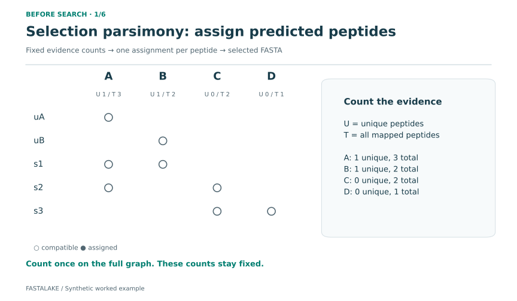
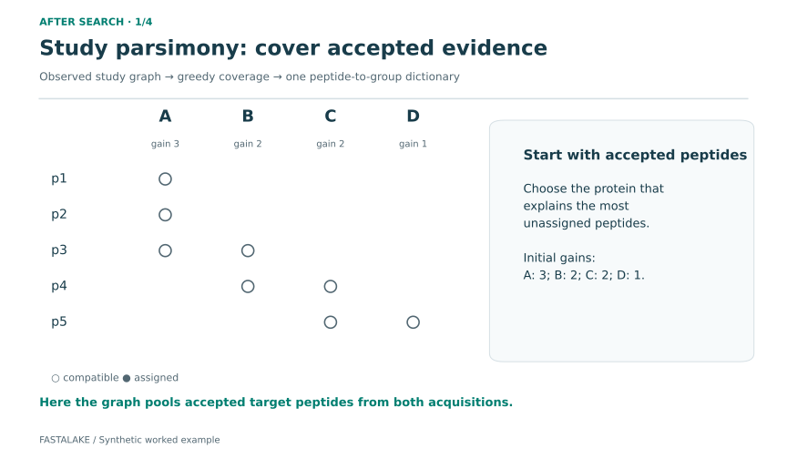
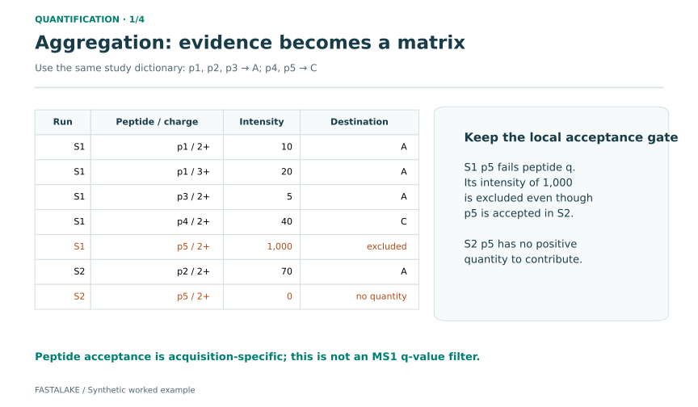

# Watch evidence become a study matrix

FastaLake makes three different decisions: **which complete protein sequences
to search**, **how to report accepted peptide evidence**, and **how to combine
its measured intensities**. Follow them below with small, invented examples.

Use **Next** to inspect a step, or **Play** to run the explanation. Nothing plays
automatically. Written steps and downloadable stills give the same explanation
without animation. Letters are illustrative protein accessions; peptide labels
stand for distinct sequences, not spectra or intensities.

| Decision | Input | Output | Rule |
|---|---|---|---|
| Selection parsimony, before search | Predicted peptides mapped onto candidate proteins | A compact target FASTA | Fixed unique and total evidence counts; deterministic hash ties |
| Study grouping, after search | Accepted target peptides and their reported proteins across a declared study | A peptide-to-group dictionary | Repeatedly explain the most uncovered peptides; lexical ties |
| Sum aggregation | Positive finite LFQ features passing the local peptide acceptance gate | A group-by-acquisition matrix | Assign through the dictionary; sum each included feature once |

## 1. Which candidates survive selection parsimony?

**A protein does not need a unique peptide to survive.** It needs to receive an
assignment. The example deliberately includes C, supported only by shared peptides.

<div class="fl-explainer" data-story="razor.json" markdown="1">

{ .no-lightbox }

</div>

1. Count each protein's unique mapped peptides (**U**) and total distinct mapped
   peptides (**T**) on the whole graph. These counts stay fixed.
2. Assign shared s1 to A: A and B tie on U, but A has more total evidence.
3. Assign s2 to A: A has unique support; C has none.
4. Assign s3 to C: C and D have no unique support, but C has more total evidence.
5. Assign uA to A and uB to B, their sole compatible proteins.
6. Retain complete proteins A, B and C. D receives no assignment.

If U and T both tie, the supported runner uses the smallest 64-bit FNV-1a hash
of the accession, followed by lexical order for a remaining hash collision.
This tie rule is distinct from the SHA-256 identity of a protein sequence.
Presentation order does not affect this fixed-count `hash-acc` result.

[Download GIF](figures/walkthrough/razor/razor.gif) ·
[Final still](figures/walkthrough/razor/summary.png) ·
[Exact rule and identity conventions](algorithms.md#the-implemented-rust-razor-rule)

## 2. How does study parsimony build a common dictionary?

Now use a **different graph, built from accepted search peptides**. The study
rule keeps track of evidence already covered; its gains change after selection.

<div class="fl-explainer" data-story="study.json" markdown="1">

{ .no-lightbox }

</div>

1. A explains three uncovered peptides; B and C each explain two; D explains one.
2. Select A and assign p1, p2 and p3. B now adds only p4, while C adds p4 and p5.
3. Select C and assign p4 and p5. Every observed peptide is covered.
4. Report groups A and C. Equal gains use lexical accession order. This greedy
   procedure need not produce the smallest possible cover.

The first selected representative explaining a peptide keeps its assignment.
The declared study roster matters: changing the accepted graph can change the
dictionary. Preserve full local memberships as well as the group label.

[Download GIF](figures/walkthrough/study/study.gif) ·
[Final still](figures/walkthrough/study/summary.png) ·
[Output contract](output-contract.md)

## 3. How do measured features become quantities?

Use that same dictionary: p1–p3 belong to A, p4–p5 to C. **Each included LFQ
feature contributes once, within its own acquisition.** Multiple charges or
modifications can contribute to one canonical peptide.

<div class="fl-explainer" data-story="aggregation.json" markdown="1">

{ .no-lightbox }

</div>

1. S1 accepts p1, p3 and p4 at target peptide q ≤ 0.01. S1 p5 has q = 0.20;
   its intensity of 1,000 is excluded. Acceptance of p5 in S2 cannot rescue it.
2. In S1, p1 contributes two features (10 and 20), and p3 contributes 5 to A.
   p4 contributes 40 to C. In S2, p2 contributes 70 to A; accepted p5 has zero
   intensity, so it supplies identification evidence but no positive quantity.
3. The matrix is A = (35, 70), C = (40, blank). Included input and output
   intensity both total 145. A blank cell means unquantified, not biological absence.

This is the study utility's default **sum** route. Its acceptance gate is the
search's target peptide q value, not an additional cutoff on the MS1 LFQ
`q_value`. [directLFQ](../how-to/quantification.md) uses the same assignments
but estimates quantities differently; it is not described by this sum example.

[Download GIF](figures/walkthrough/aggregation/aggregation.gif) ·
[Final still](figures/walkthrough/aggregation/summary.png) ·
[Read the actual output files](../how-to/read-outputs.md)

## Try it and inspect the evidence

Run the [two-acquisition CAMPI example](../get-started/first-study.md), then open
the selected FASTA, `peptide_to_study_group.tsv`, `feature_assignments.tsv.gz`
and `study_group_matrix.tsv`. Those files let you follow a peptide through the
same decisions on measured data.

To regenerate these illustrations from the repository root:

```bash
python tools/animate_concepts.py --out concept_frames_01
```

Use a new output directory and the documentation Python environment. The script
executes `study_dictionary` and `group_searches` on synthetic inputs, checks the
displayed matrix and conserved intensity, and records source hashes in
`CHECK.json`. The razor animation is a teaching trace of the Rust comparator;
rendering it does not execute the native engine or validate scientific accuracy.
