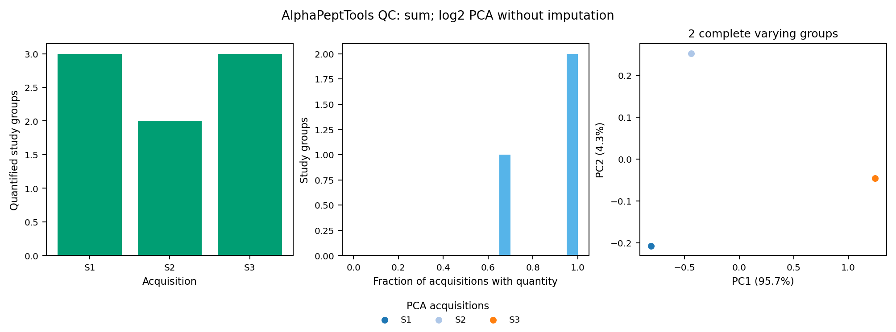

# The demo

One command runs every bundled example inside the Docker image and checks the results, leaving everything in a folder you can inspect. The examples are teaching inputs: real spectra cropped to acquisition windows, plus small synthetic fixtures for the routes the real data cannot exercise.

From the repository root, with Docker running:

```bash
bash tools/check_local_docker.sh docker_check_01
```

The first build downloads dependencies and compiles the Rust tools. The finished
image runs the examples without network access, with 4 GiB RAM and two CPU slots
per container. The build has separate resource needs. [Install](install.md) covers Apple Silicon emulation and downloading an already tested image.

## Open these first

| Path inside `docker_check_01/` | What it shows |
|---|---|
| `campi/study/qc/QC_overview.png` | Coverage and completeness for two measured CAMPI acquisition windows |
| `campi/study/qc/Protein_intensity_violins.pdf` | Positive group-intensity distributions, method and missingness |
| `community/taxonomy/index.html` | Interactive Unipept sunburst, treemap and tree using recorded public assignments |
| `community/taxonomy/Holobiont_balance.pdf` | Community context with counts and summed feature intensity |
| `community/functions/protein_annotations.tsv` | One real eggNOG enolase match and explicitly partial annotation coverage |
| `campi/study/study_group_matrix.tsv` | Sum quantities, with blanks for unquantified observations |
| `campi_directlfq/study_group_matrix.tsv` | directLFQ quantities for the same reporting groups |
| `campi/study/peptide_evidence.tsv.gz` | The accepted peptides behind each group |
| `synthetic_analysis/sum/qc/PCA.png` | Eligible PCA on an explicitly synthetic three-acquisition fixture |
| `multiomics/workflow/samples/S01/molecular/gene_evidence.tsv` | Why each molecular candidate was selected or excluded |
| `functional/results/Functional_QC.png` | Experimental functional coverage/diversity on a synthetic paired design |

Each example writes a `VALIDATION.json` with its checks and scope. The parent
folder also contains one log per example, such as `campi.log` and
`multiomics.log`.

!!! note "Every run gets a new folder"
    Existing output directories are refused, so earlier runs are never overwritten. Choose a new name such as `docker_check_02` for the next run.

### A generated report



This preview comes from the labelled synthetic example. It shows how coverage,
missing observations and eligible PCA appear together. The measured CAMPI
examples have their own reports. [Preview provenance](../assets/demo_qc_synthetic.json).

## What runs

| Example | Inputs | What the check verifies |
|---|---|---|
| Reference construction | Small synthetic proteins/predictions | Build a lake, retain source headers, extract evidence and select compact databases |
| CAMPI | Measured spectra and matching de novo predictions, cropped to acquisition windows | Rust selection → Sage → study groups → sum and QC |
| directLFQ | Accepted CAMPI quantitative features | Quantify fixed groups and preserve acquisition identity/missing observations |
| PCA | Explicitly synthetic three-acquisition data | Sum and directLFQ PCA, with a missing observation excluded from the complete core |
| Multi-omics | Real CAMPI sequences/spectra with synthetic DNA/RNA/compound values | Prepare sources, record missing genes, preserve de novo targets, add candidates, search and quantify |
| Chunked laptop mode | Both measured teaching datasets | Identical selected FASTAs and study quantities with reference pieces; resource plan recorded |
| Search choices | Measured CAMPI windows | All six closed/open × tryptic/semi-tryptic/unspecific combinations; bounded 7–15-aa teaching searches (the container check passes `--search-max-length 15`; the example's default is 30) |
| Community and evidence | Recorded native public CAMPI Unipept results and one real eggNOG annotation | Conserved counts/intensity, offline plots, full peptide–protein export and exact annotation join |
| Experimental function | Synthetic annotated profiles and paired metadata | Signal conservation, coverage, diversity, CLR PCA and within-donor permutations |
| Installation/output checks | Local fixtures | Executable availability, optional annotation wiring, offline resource menu and refusal to overwrite results |

!!! info "Why PCA comes from a synthetic fixture"
    The two measured CAMPI acquisitions do not meet the minimum of three for PCA. They receive QC and an explicit PCA exclusion. The separately labelled synthetic fixture exercises PCA; it is not extra biological data.

## Optional external resources

Normal demo execution does not download protein catalogues, eggNOG databases or
model weights. The [resource helper](../how-to/references.md) shows their sizes
and downloads only the resource you choose to your local directory.

Real eggNOG and optional ESM-C need those external resources and their configured
tools. The offline demo checks annotation wiring with an explicit synthetic mapper
fixture; actual model/database execution has separate component acceptance records.
See [annotation setup](../how-to/annotation.md) to run it on selected proteins.

## Move from the demo to your study

Follow [Your first study](first-study.md) to replace the example inputs
with an acquisition manifest and your prepared reference. Add matched DNA/RNA
only when available, choose sum or directLFQ, and inspect the resulting QC.

The teaching inputs establish execution and accounting. For full acquisitions,
use the [compute guide](../how-to/compute.md), which records the large-reference
RAM, time and disk scope separately. Molecular performance evidence and scientific
interpretation are described in the [benchmark guide](../concepts/molecular-benchmark.md).
