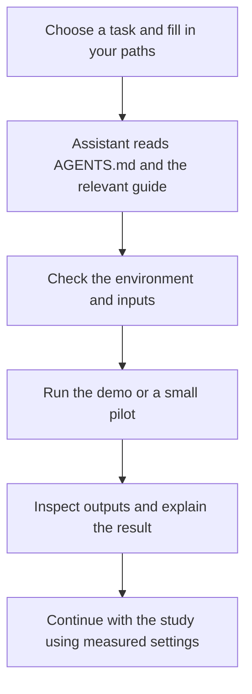

# Set up and run FastaLake with an assistant

An agent or LLM can help install FastaLake, prepare inputs, run a study and
explain the results. Give it the checked-out documentation and your actual
paths so it can work from the same commands you would use.

## Ready-to-copy task files

Open the repository in your agent, ask it to read `AGENTS.md`, then give it
one of these files with your paths filled in. The same text works in a chat:
run the proposed commands yourself and return the output for checking.

| Task | Prompt file | Example input |
|---|---|---|
| Install and inspect the demo | [install-and-demo.md](https://github.com/MannLabs/fasta-lake/blob/main/examples/assistant-tasks/install-and-demo.md) | [Bundled demo](../get-started/demo.md) |
| Run your own acquisitions | [first-study.md](https://github.com/MannLabs/fasta-lake/blob/main/examples/assistant-tasks/first-study.md) | [Working TSV](https://github.com/MannLabs/fasta-lake/blob/main/examples/campi/inputs/samples.tsv) |
| Add matched DNA/RNA | [molecular-inputs.md](https://github.com/MannLabs/fasta-lake/blob/main/examples/assistant-tasks/molecular-inputs.md) | [Molecular example](https://github.com/MannLabs/fasta-lake/blob/main/examples/multiomics/README.md) |
| Size and submit a cluster pilot | [cluster-pilot.md](https://github.com/MannLabs/fasta-lake/blob/main/examples/assistant-tasks/cluster-pilot.md) | [Site template](https://github.com/MannLabs/fasta-lake/blob/main/examples/site/README.md) |
| Diagnose a failure | [troubleshoot.md](https://github.com/MannLabs/fasta-lake/blob/main/examples/assistant-tasks/troubleshoot.md) | Your failed run and stage logs |
| Understand a completed study | [read-results.md](https://github.com/MannLabs/fasta-lake/blob/main/examples/assistant-tasks/read-results.md) | Your matrix, peptide evidence and QC |

Each file contains an input checklist, the relevant guides, the requested work
and the checks needed to call it finished. Browse the
[whole task folder](https://github.com/MannLabs/fasta-lake/tree/main/examples/assistant-tasks).

## What to tell the assistant

Supply the computer or cluster, repository path, input locations, new output
directory and resource limits. For a real study, include the acquisition
manifest and any specimen mapping. Ask it to explain missing inputs before
guessing scientific settings.

A coding agent with terminal access can inspect and run the workflow. A chat
assistant can guide you through commands and review the output you return.
Establish which machine and files it can actually reach.

## What a completed task should give you

- The revision, environment and exact command.
- Result paths, including the study matrix, QC and peptide evidence.
- Checks performed, skipped steps and unresolved questions.
- For cluster work, the job status and measured memory, time and disk.

The task files ask for these checks explicitly. A generated plot or a submitted
job alone does not show that the workflow finished.
