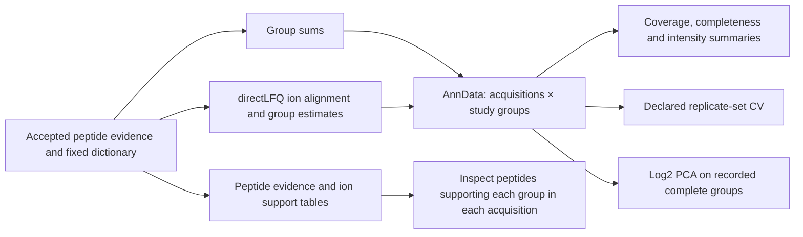

# Analyse a study with AlphaPeptTools

This page shows how to run QC, replicate CV and PCA on a completed study and
how to read what is saved. You need a completed grouped study with sum or
directLFQ quantities. `fasta-lake analyze-study` connects fixed FastaLake study quantities to
[MannLabs/alphapepttools](https://github.com/MannLabs/alphapepttools), using release
[0.4.0](https://github.com/MannLabs/alphapepttools/tree/v0.4.0). It works on original group
sums or completed optional directLFQ quantities. It does not repeat grouping or search.



## Standard output

QC plots are produced automatically by `tools/run_manifest.py`,
`tools/group_study.py` and `fasta-lake quantify-study`. The runner writes
`study_groups/qc/`; the other commands write `qc/` inside their output.
Coverage/completeness always appears in `QC_overview.png` and `.pdf`.
Protein intensity violins in `Protein_intensity_violins.pdf` and numbered PNG
pages show positive log2 quantities, medians/IQR and missing fractions. Constant
or single observations are points, not estimated densities; empty acquisitions
remain labelled. `intensity_distribution.tsv` contains the source values.
Eligible datasets also receive `PCA.png` and `.pdf`, plus the numeric PCA tables.
The matrix uses the selected sum or directLFQ quantities. There is no automatic
batch correction or imputation.

The Docker image includes the required analysis environment. For source use,
install `.[analysis,directlfq]` on Python as required by the [installation page](../get-started/install.md#source-installation).
`--skip-qc` explicitly omits analysis in a core-only installation; the
workflow records that choice. Database-only runs do not need analysis dependencies.
Missing analysis dependencies fail preflight before new grouping or searches.

## Analyze an existing result

The analysis environment needs Python as required by the [installation page](../get-started/install.md#source-installation).

```bash
python -m pip install '.[analysis,directlfq]'

# Original group sums, without additional normalization.
fasta-lake analyze-study --groups grouped --out qc_sum

# Existing directLFQ result (the quantify-study output directory), without a second normalization.
fasta-lake analyze-study --groups grouped --quantification quantities_lfq \
    --out qc_lfq --metadata samples.tsv --replicate-column replicate_set
```

`--metadata` takes a TSV with a unique `sample` column and exactly the acquisition roster
in the matrix. Rows are matched by identifier, regardless of file order. Additional columns
are preserved in `AnnData.obs`. Duplicate or missing sample identifiers cause an error.
The string `NA` is preserved as an identifier. In the declared replicate column, a blank
value excludes an acquisition from CV calculations; nonblank labels define sets. Only use
technical/workflow repetitions when interpreting CV as precision. Patient groups are not
replicate sets merely because they have the same diagnosis.

To compare PCA across quantification methods, explicitly supply the same acquisition roster
and a list of groups measured in every chosen acquisition under both methods:

```bash
fasta-lake analyze-study --groups grouped --quantification quantities_lfq --out qc_lfq_matched \
    --pca-samples acquisitions.txt --pca-features shared_groups.txt
```

Each list contains one identifier per line, without a header. Requested incomplete features
cause an error. Without the lists, PCA uses all nonempty acquisitions and groups complete
within those acquisitions. Constant groups are excluded and recorded. PCA is skipped, with
an explicit status, if fewer than three nonempty acquisitions or two complete varying groups
remain. Empty acquisitions stay in the main object and coverage table.

## What the functions do

| Operation | Upstream function | FastaLake interpretation |
|---|---|---|
| Coverage, completeness, intensity sums | `metrics.calculate_qc_metrics` | Computed on positive linear quantities; sum of no quantities is zero, not measured absence |
| Separate log2 layer | `pp.nanlog` | No pseudocount, imputation, sample normalization or unit-variance scaling |
| PCA | `tl.pca` | Feature-centered log2 PCA; complete varying groups, deterministic full SVD |
| Replicate CV | `metrics.coefficient_of_variation` | Original linear quantities; at least two observed values; denominators retained |

AlphaPeptTools 0.4.0 uses `numpy.nanstd` with ddof=0 in its CV implementation. FastaLake retains
this result as `cv_population_pct` and additionally report `cv_sample_pct`, multiplied by
`sqrt(n/(n-1))`, where `n` is that group's observed acquisition count within the set.
The latter matches the ddof=1 convention of the FastaLake comparison audit. The complete
flag and observed counts make the comparison population explicit. No across-patient CV is
automatically interpreted as repeatability.

The package also offers normalization, imputation, principal-component regression,
differential abundance (t-tests, empirical Bayes and AlphaQuant wrappers), and volcano plots.
Those functions are available on the exported object, but are not automatically applied by
this command. Contrast definitions, independent versus repeated sampling, covariates,
missing-data assumptions and the tested feature universe must be specified before biological
inference. A volcano is a rendering of those choices; using a library does not validate them.

## What is saved

- `study.h5ad`: all original matrix acquisition and group axes; `.X` holds selected linear
  quantities with missing values as NaN, `.layers["log2"]` holds their logarithms. `.obs` retains
  sample metadata/QC and PCA inclusion; `.var` retains group QC and PCA eligibility.
- `sample_qc.tsv`, `group_qc.tsv`: the same descriptive metrics in readable form.
- `replicate_cv.tsv.gz`: long table with population/sample CV, measured count, set size and
  completeness for every declared set and group. Header-only when no sets are supplied.
- `pca_scores.tsv`, `pca_loadings.tsv`, `pca_variance.tsv`: produced when PCA is estimable;
  omitted samples/groups have missing coordinates/loadings. The full object also stores them.
- `PCA.pdf` and `.png`: standalone PC1/PC2 plot when eligible.
- `QC_overview.pdf` and `.png`: acquisition coverage, group recurrence and exploratory PCA.
  PCA legends on small studies identify acquisitions; bar positions use one-based row order.
- `peptide_to_study_group.tsv`: unchanged dictionary for joining peptide evidence to quantities.
- `summary.json`: source paths/checksums, package versions, backend source hashes, settings,
  output hashes and scope. The original evidence ledgers remain at the recorded source paths;
  preserve those files when moving an evidence bundle. `study.h5ad` is self-contained for QC,
  but does not embed every PSM or source spectrum.

For Python analysis:

```python
import anndata as ad
import pandas as pd

adata = ad.read_h5ad("qc_lfq/study.h5ad")
quantities = adata.to_df()  # acquisitions × fixed reporting groups

# New group_study outputs retain identifications even without a measured LFQ quantity.
ids = pd.read_csv("grouped/peptide_evidence.tsv.gz", sep="\t", keep_default_na=False)
support = pd.read_csv("lfq/peptide_support.tsv.gz", sep="\t", keep_default_na=False)
keys = ["sample", "study_group", "canonical_peptide"]
evidence = ids.merge(support, on=keys, how="left", validate="one_to_one")
# Filter evidence by the desired acquisition and reporting group. A missing support
# row means there was no admitted quantified feature for that identification.
```

Older frozen group bundles may lack `peptide_evidence.tsv.gz`; their admitted quantified
features remain in `feature_assignments.tsv.gz`. Those are not an inventory of all accepted
identifications. Read [quantification and evidence](quantification.md) for the complete
identifier and admission definitions.

## Do these plots make sense for metaproteomics?

Coverage, missingness and peptide support are useful directly. PCA is an exploratory summary
of a specified matrix. It can reflect organism/community composition, protein regulation,
sample preparation, run effects, database coverage or quantification choices. Without further
evidence, the plot cannot distinguish those explanations. Group intensity also depends on
peptide response and which sequences are observed, so this is not a species-abundance PCA.

For method comparisons, keep the sample/feature population fixed and show coverage losses
beside precision or ordination. Separate PCA fits have arbitrary signs and different axes;
coordinate movement between two plots is not a paired biological effect. A tighter cloud
is not proof of greater concentration accuracy or better preservation of biology. Restricting
to complete groups selects a recurring subset and does not describe the sparse proteome.

Shared-peptide support is particularly important: the same group can have different measured
peptides in different samples, and those peptides can be compatible with multiple organisms.
Representative accession labels should not automatically become species labels or unique gene
identities. Taxonomic/functional aggregation and enrichment need their own reviewed ambiguity
and background rules. The generic package does not supply metaproteomic origin resolution.

Useful extensions include metadata-aware PCA/PCR and properly specified differential abundance.
They can be built on these objects once the scientific comparison is declared. Imputation,
batch correction and pathway mapping are substantial analytical choices, not cosmetic plot
options. The current adapter records its transformations explicitly.
