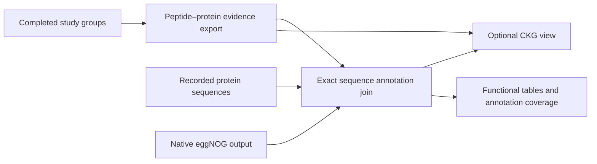

# Build an evidence network

An evidence network helps explain which accepted peptides support which
reported proteins. FastaLake exports the complete relationships and can render
a bounded view through the **Clinical Knowledge Graph (CKG)** tools.
The renderer is experimental; the complete evidence tables remain available
without CKG or a graph database.



## Export and add existing eggNOG results

```bash
fasta-lake network export --groups grouped --out evidence_network

fasta-lake network eggnog --bundle evidence_network \
  --annotation annotations \
  --fasta grouped/representatives.fasta --out network_functions
```

`annotations` is a completed result from [FastaLake annotation](annotation.md).
For native eggNOG output, pass its filename as `--annotation` and add
`--query-fasta original_annotation_queries.fasta`. Keep the original query
sequences: matching names alone is insufficient. The selected FASTA must be
the recorded study representatives or a recorded search FASTA.

The join checks full protein sequence identity. Different identifiers may
share the same exact sequence; I/L-equivalent proteins are still distinct
annotation queries. No-hit, unmatched and unavailable sequences remain in
`protein_annotations.tsv`. Protein-to-function edges record annotation, not
measured activity. An annotation is never propagated into a claim that an
ambiguous peptide came uniquely from that protein.

KO, EC, GO and PFAM are retained by default; `--field` selects namespaces.
`group_terms_KEGG_ko.tsv` and equivalent files can feed the existing
[functional exploration](functional-exploration.md) command with your selected
sum/directLFQ matrix and declared metadata. The
[biological interpretation guide](core-functions.md) distinguishes commonly
shared functions from specialised community capabilities.

## Render with a compatible CKG environment

Use a separately configured CKG installation. The worker runs in its Python
environment and calls its analytics and visualization modules; it does not
connect to Neo4j. The [compatibility notes](https://github.com/MannLabs/fasta-lake/blob/main/integrations/ckg/README.md)
describe the tested environment and small proposed upstream fixes.

```bash
fasta-lake network render --bundle evidence_network \
  --annotations network_functions \
  --ckg-python /path/to/ckg-environment/bin/python \
  --ckg-source /path/to/compatible-CKG \
  --max-nodes 150 --max-edges 300 --out network_report
```

Open `network_report/index.html`. The interactive view, PNG/PDF/SVG overview
and full evidence count plot are local files. Hover over a node for identifiers
and support. Full node/edge tables remain in the original export.

- **Solid edge:** assigned reporting representative.
- **Dashed edge:** another reported peptide membership.
- **Purple dotted edge:** eggNOG orthology annotation.

The view is intentionally bounded and reports visible versus total counts.
KO/EC annotations appear in the overview; the full annotation export retains
the additional namespaces. CKG's topological communities describe this graph's
connections. They are not pathways, protein interactions or an independent
protein inference result.

The offline Docker demo includes a real CAMPI evidence export and one recorded
enolase annotation. This demonstrates the join with deliberately partial
coverage. CKG rendering uses the separate optional environment above.

## Credit and provenance

Network analysis and interactive plots reuse CKG, NetworkX, Plotly and PyVis.
FastaLake preserves the peptide evidence and adds the exact annotation join.
`RENDER_COMPLETE.json` records source hashes, versions, view limits and outputs.
The CKG and eggNOG citations appear in reports and exported network figures.

- Santos A et al. *A knowledge graph to interpret clinical proteomics data.*
  Nature Biotechnology 40:692–702 (2022).
  [doi:10.1038/s41587-021-01145-6](https://doi.org/10.1038/s41587-021-01145-6).
- Cantalapiedra CP et al. *eggNOG-mapper v2: functional annotation, orthology
  assignments, and domain prediction at the metagenomic scale.* Molecular
  Biology and Evolution 38:5825–5829 (2021).
  [doi:10.1093/molbev/msab293](https://doi.org/10.1093/molbev/msab293).
