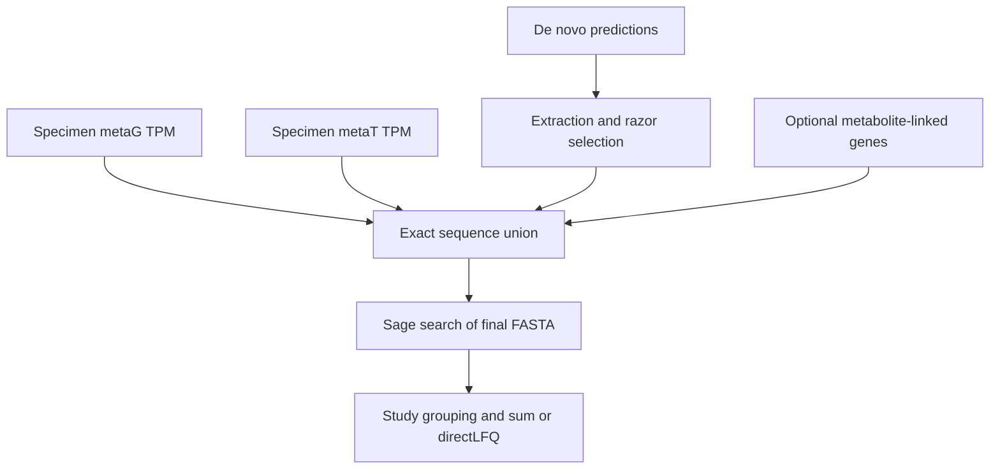

# Add metaG and metaT evidence to de novo selection

FastaLake can add specimen-matched **metaG (DNA TPM)** and **metaT (RNA TPM)**
evidence on top of the de novo result. Both layers use the same gene-to-protein
mapping. Each layer can be enabled independently or combined; optional
metabolite-linked candidates use the same reference.

For Docker, follow the complete [prepare-and-run tutorial](molecular-docker.md).
The commands below document the same interface from a source installation;
run the manifest script from the repository root.



Every de novo protein and header stays in the final FASTA. Molecular
candidates are added after razor selection, before Sage. Missing measurements
never count as support. The evidence tables distinguish selected genes, exact
protein additions, and peptides subsequently identified by the search.

## Prepare one source per specimen { #1-prepare-one-source-per-specimen }

Supply a protein FASTA, a shared gene TPM table, and a provenance record explaining
how the gene IDs, assembly and specimen were linked. TPM is an upstream input;
FastaLake does not quantify sequencing reads or infer specimen identity from
filenames. There is no upload service or remote registration step.

```text
prodigal_protein	metaG_tpm	metaT_tpm
gene_A	12.5	3.2
gene_B	0	NA
```

Both columns are present. Use `NA` for an unavailable layer or measurement.
Zero denotes a measured zero. The v2 importer also treats blank, null and NaN
spellings as missing. Protein IDs must match `prodigal_protein`.

Save the source provider's linkage notes as `raw/specimen_A_reference.json`.
For example, a record can contain these fields; replace the illustrative values
with the actual sequencing/assembly records:

```json
{
  "specimen": "specimen_A",
  "reference_id": "assembly_A_v1",
  "gene_id_field": "prodigal_protein",
  "protein_source": "specimen_A_genes.faa",
  "tpm_source": "specimen_A_tpm.tsv",
  "linkage_evidence": "Path or identifier of the provider's specimen/reference mapping",
  "unresolved_details": "Record missing or unverified linkage here"
}
```

This provider record is copied and hashed; its field names are a documentation
convention, not an enforced schema. The importer checks file/gene/sequence
consistency. Specimen provenance still comes from the provider's records.

```bash
fasta-lake molecular prepare-source \
  --specimen specimen_A --reference-id assembly_A_v1 \
  --tpm raw/specimen_A_tpm.tsv --proteins raw/specimen_A_genes.faa \
  --provenance raw/specimen_A_reference.json \
  --out inputs/specimen_A

fasta-lake molecular validate-source --source inputs/specimen_A/source.json
```

This copies checked inputs into a new portable folder, writes their checksums,
and exports `reference.fasta` plus a coverage report. Keep the folder together
when moving it.

The default `--reference-scope complete` requires identical TPM and protein gene
populations. If the available FASTA omits known TPM genes, explicitly use
`--reference-scope available`. Missing genes and their original metaG/metaT
values are exported to `unavailable_genes.tsv`; proteins lacking TPM rows have a
separate ledger. Neither group participates in molecular selection. Coverage
reports state these exclusions. This mode does not claim to reconstruct an
unavailable original reference.

An optional `--alternate-proteins` verifies normalized sequence agreement against
a second source copy. The provenance record remains the provider's biological
linkage evidence; passing file checks alone does not establish specimen origin.
Existing v1 source manifests remain supported with their original strict checks.

## Bind each acquisition to its specimen source

Add `molecular_source` and `specimen` to the ordinary acquisition manifest:

```text
sample	predictions	mzml	molecular_source	specimen
run_A	raw/run_A_predictions.csv	raw/run_A.mzML	specimen_A/source.json	specimen_A
run_B	raw/run_B_predictions.csv	raw/run_B.mzML	specimen_A/source.json	specimen_A
```

Paths resolve relative to the manifest. Multiple acquisitions can use the same
specimen source. The runner rejects missing or mismatched specimen/source pairs
before creating a run. Rows without both optional fields retain the ordinary
de novo-only workflow.

## Run the additive workflow

```bash
python tools/run_manifest.py \
  --manifest inputs/samples.tsv --lake reference_lake.fasta \
  --molecular-dna-percent 100 --molecular-rna-percent 100 \
  --quantification directlfq --out results/run_01
```

Here `100` includes every positive available gene in each layer. It illustrates
the all-positive benchmark condition; it is not a universal cutoff recommendation.
Set either percentage to `0` to disable that layer. The compatibility default
for DNA is 1%; RNA is off until specified. Smaller percentages retain the top
fraction of positive genes, with floor rank, a minimum of one gene, and all
boundary ties. Ranking happens before protein deduplication, independently for
metaG and metaT. I/L variants remain distinct protein sequences.

Absolute thresholds are also available:
`--molecular-dna-absolute` or `--molecular-rna-absolute`, with the corresponding
percentage set to zero. They use strict greater-than comparisons.

The runner validates inputs, performs de novo extraction and razor selection,
adds the molecular candidates, searches the union with Sage, then groups and
quantifies the study and writes QC/PCA plots under `study_groups/qc/`. Use `--validate-only` for preflight or
`--databases-only` to inspect FASTAs before searching. A common target-only
host/contaminant FASTA can be supplied with `--background`.

For an already completed de novo FASTA, the same addition can be run directly:

```bash
fasta-lake molecular add \
  --baseline selected/run_A_razor.fasta \
  --source inputs/specimen_A/source.json --specimen specimen_A \
  --dna-percent 100 --rna-percent 100 --out additions/run_A
```

Search `additions/run_A/search.fasta` with the same spectra and search settings,
generating decoys from the final union. The normal runner performs this step
automatically. Do not apply another razor or clustering pass to the union.

## Inspect the addition and its measured effect

For each acquisition, `samples/<sample>/molecular/` contains:

| File | Meaning |
| --- | --- |
| `search.fasta` | All de novo proteins plus exact molecular additions |
| `gene_evidence.tsv` | Original gene IDs, both TPM values, layer-specific rules, exact hashes and final accessions |
| `unavailable_genes.tsv` | TPM genes with no available sequence, including both measurements |
| `REFERENCE_COVERAGE.json` | Reference, measurement and annotation coverage |
| `COMPLETE.json` | Rules, counts and input/output/code hashes |

More selected genes can increase database size substantially. Candidate additions
are distinct from identified peptides; a larger search may gain some identities
and lose others. Compare the completed searches explicitly:

```bash
fasta-lake molecular compare \
  --left results/denovo/search/run_A --right results/augmented/search/run_A \
  --left-label de_novo --right-label de_novo_plus_molecular --out comparison/run_A
```

## Optional metabolite-linked additions

Add these files when preparing a source:

- `--annotations`: TSV with unique `prodigal_protein` and `KEGG_ko` columns
  (comma/semicolon-separated K numbers, with optional `ko:` prefixes).
- `--metabolites`: TSV with `specimen`, `compound`, `value`; one row per
  compound for that specimen. Compound IDs use `C00001` format.
- `--compound-links`: frozen direct-link TSV with `compound`, `reaction`,
  `KO` (for example `C00001`, `R00001`, `K00003`).

Then enable `--molecular-metabolites` in the runner, or `--metabolites` in
`molecular add`. Positive supplied compounds select their directly linked KOs,
then annotated genes in the same reference. The union still preserves every
de novo protein. Compound and reaction/KO evidence is exported separately.
The code does not rank different compounds by intensity, expand whole pathways
or infer reaction direction, flux, producing species or unique enzyme identity.

## Advanced matched-reference comparisons

The default runner augments the reservoir-derived de novo baseline. To reproduce
the benchmark's common-reference design, use `--molecular-reference shared`
and omit `--lake`. Every row must have a source. De novo extraction then starts
from all available specimen gene sequences, including genes with zero/missing TPM;
molecular additions still occur after razor. This changes the starting reference
and must be reported separately from the broader-reservoir comparison.

`fasta-lake molecular select` exposes standalone molecular FASTAs for comparator
arms. The primary user workflow is `molecular add` or the additive runner above.

## Examples, Docker and evidence

The [additive acceptance example](https://github.com/MannLabs/fasta-lake/blob/main/examples/multiomics/README.md) uses real
CAMPI spectra and artificial molecular values to check the full workflow.
The Docker acceptance command includes it. Use the same flags and source folder
inside the [documented container mounts](../get-started/docker.md).

[Completed benchmark evidence](../concepts/molecular-benchmark.md) and the
v7 proposal and source tables in the private review record (not part of this
repository) describe the measured scope. Support for both input layers is distinct from completed
cohort performance evidence for each layer.

## Exact protein gains and losses

Use [molecular increments](protein-increments.md) to report reference-wide peptide and protein support, candidate additions, reciprocal losses and shared LFQ agreement after a DNA/RNA union.
