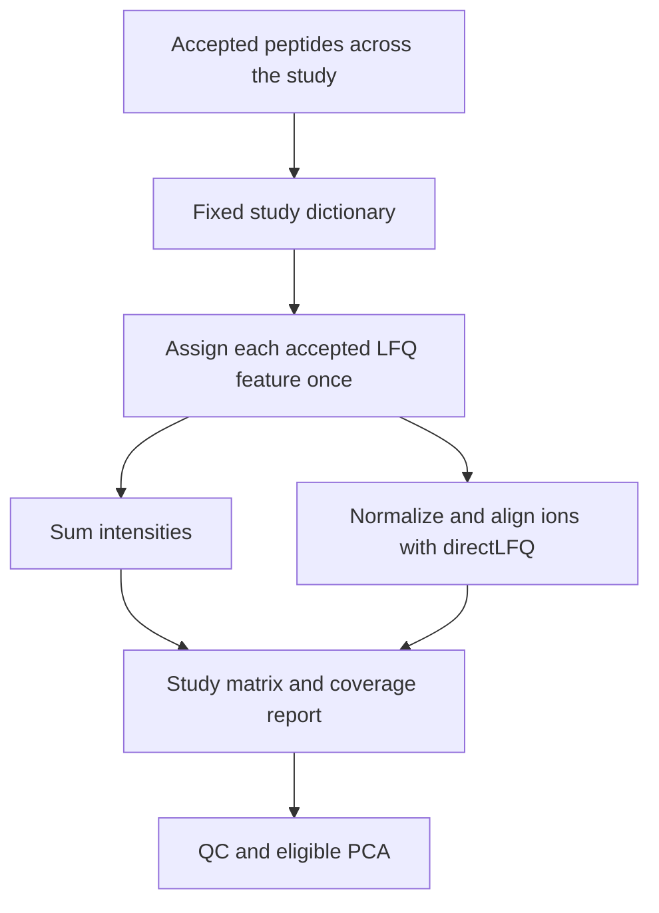

# Quantify a study

FastaLake assigns accepted peptides to a fixed set of study-level protein groups,
then estimates a quantity for each group in each acquisition.

| Method | Use it for | What changes |
|---|---|---|
| **Sum** — default | Direct summaries of accepted positive LFQ intensity | Adds assigned feature intensities; no sample normalization |
| **directLFQ** | Quantification from shared ion profiles across acquisitions | Normalizes and aligns ions; some quantities may be lost |

Both methods use the same reporting dictionary. Missing output cells stay blank.



## Choose a method in the full workflow

The [manifest runner](../get-started/first-study.md) uses sum by default.
Add `--quantification directlfq` to select directLFQ. The selected matrix is
`study_groups/quantification/study_group_matrix.tsv`; the original sum matrix
remains in `study_groups/`.

## Quantify existing searches

From the repository root in the [installed environment](../get-started/install.md):

```bash
python tools/group_study.py --search study_run/search --out study_groups \
  --quantification directlfq --threads 4
```

Or quantify an existing grouping bundle:

```bash
fasta-lake quantify-study --groups study_groups --method sum --out quantities_sum
fasta-lake quantify-study --groups study_groups --method directlfq --out quantities_lfq --threads 4
```

Each output directory must be new. The directLFQ route requires the optional
backend; Docker includes it.

## Open these outputs

| File | What it tells you |
|---|---|
| `study_group_matrix.tsv` | Quantities for the declared acquisition roster |
| `coverage.tsv` | Groups quantified by each method and any coverage loss |
| `summary.json` | Method, settings and source bundle |
| `qc/QC_overview.png` | Coverage, missingness and PCA eligibility |

For the full runner, QC lives under `study_groups/qc/` and follows the selected
method. The lower-level Python quantification function does not run QC itself.

The source grouping bundle retains `peptide_evidence.tsv.gz` and
`feature_assignments.tsv.gz`. These distinguish accepted identifications from
positive quantified features. An accepted peptide in the same acquisition gates
LFQ inclusion; Sage's separate LFQ `q_value` is not an additional default filter.

## Follow a quantity back to its evidence

A canonical peptide has one group within a fixed study dictionary. Modified
peptides and charge states remain separate quantitative traces. Group labels
do not establish a unique biological protein or species.

See [quantification details](../reference/quantification-details.md) for the
ion merge keys, missingness, directLFQ support tables, backend settings and
retained comparisons. Coverage loss deserves attention alongside precision;
a lost quantity does not invalidate its peptide identification.

<span id="which-key-is-shared-between-samples"></span>
<span id="inspect-the-peptides-including-those-without-lfq-measurements"></span>
<span id="inspect-what-directlfq-retained"></span>
<span id="what-does-more-stringent-mean-here"></span>
<span id="quantselect-compatibility"></span>
<span id="automatic-plots"></span>
