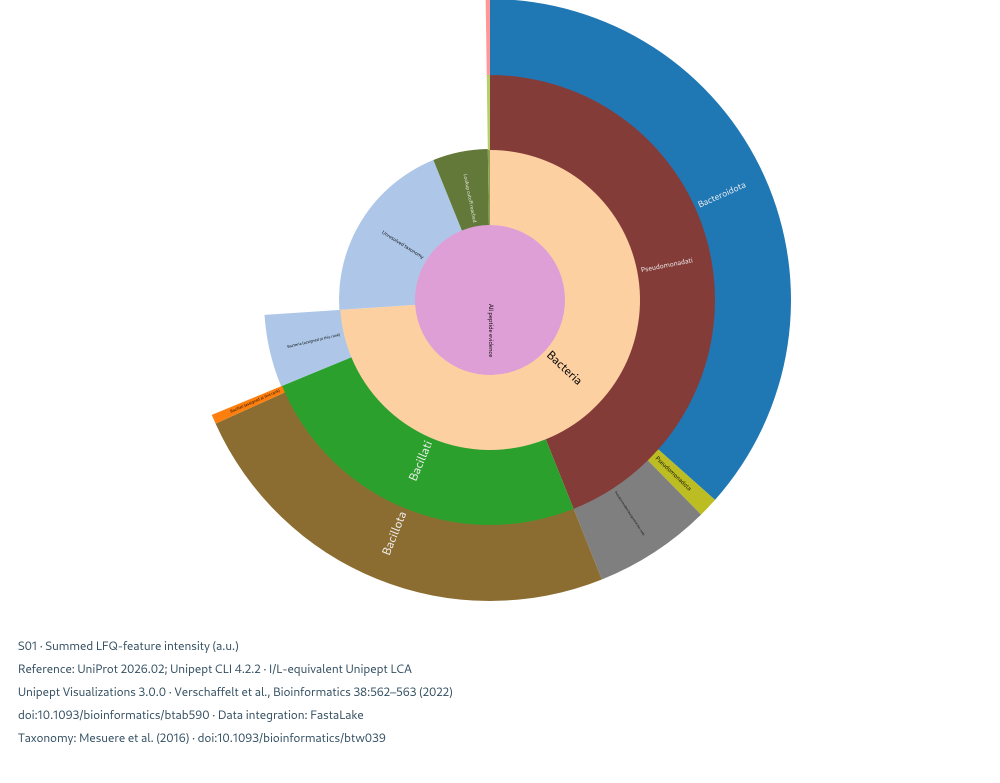

# Explore community taxonomy

FastaLake reuses Unipept's own taxonomy assignments and visualization library.
After searching and grouping, open an interactive sunburst, treemap or taxonomy
tree. Switch between distinct accepted peptides and summed LFQ-feature intensity;
the report keeps unresolved evidence visible in both views.

The [Docker demo](../get-started/demo.md) includes recorded public CAMPI results. Open
`community/taxonomy/index.html` in a current browser. It works offline, supports
zoom and hover, and exports SVG/PNG figures with citations and reference labels.
`Holobiont_balance.pdf` is the companion figure for sharing or a manuscript.



This exported example shows one measured CAMPI acquisition window; the figure
retains the tool citations and reference label. [Preview provenance](../assets/taxonomy_campi.json).

## Run on your own study

First finish the standard search and study grouping. Here `grouped` is that
completed result folder. Choose a new output directory for each command.

```bash
fasta-lake taxonomy prepare --groups grouped --out taxonomy_queries

# Run in an environment with the official Unipept CLI installed.
unipept --version
unipept pept2lca --all --equate --format json \
  --input taxonomy_queries/peptides.txt > unipept.json

fasta-lake taxonomy report --groups grouped --unipept-output unipept.json \
  --database "UniProt RELEASE; Unipept CLI VERSION" --equate-il \
  --out community_report
```

Replace `RELEASE` and `VERSION` with the actual output of `unipept --version`.
The adapter preserves the native file and records this label as user-declared;
it cannot recover a database version that the native output does not contain.
The tested CLI is 4.2.2 with Node.js 22. See the
[official CLI](https://github.com/unipept/unipept-cli) for installation and settings.
The saved-output reader accepts its full-lineage JSON or CSV. Docker includes
the report renderer and demo data; a live query uses the separately installed CLI.

!!! warning
    The CLI contacts its selected server. Its default is the public Unipept
    service, backed by UniProtKB and NCBI taxonomy. FastaLake itself performs no
    upload in these commands. Use your institution's chosen service and sharing
    arrangements for unpublished or sensitive peptide lists.

`--equate` makes I and L equivalent, matching FastaLake's canonical peptide
keys. `--all` returns the lineage needed for the hierarchy. Standard `pept2lca`
uses Unipept's tryptic reference index: a semi-tryptic or open search in Sage
does not turn this into an unrestricted taxonomy search. Inspect unreturned
peptides and record that scope when comparing search settings.

## Read the plots

| View | Meaning |
|---|---|
| Sunburst / treemap | Area represents the selected evidence measure; click to explore ranks |
| Tree | Expandable lineage and supporting evidence; branch placement is not evolutionary distance |
| Holobiont balance | Host, Bacteria, Archaea, other assigned taxa and unresolved evidence, per acquisition |
| Contaminant-reference overlap | Optional exact peptide overlap with a reference you supply |

LCA means **lowest common ancestor**: the most specific shared taxon returned
by Unipept for the matches in its reference. A genus assignment stays at genus.
“Assigned at this rank” is a plotting leaf that preserves that evidence; it
does not invent a species. Cutoff-limited, unreturned and unreported-completeness
lookups remain separate unresolved categories in the hierarchy.

Each accepted canonical peptide counts once per acquisition. Intensity sums
its positive assigned LFQ features once; this is not directLFQ taxon abundance
or organism biomass. The full denominator includes unresolved evidence.
Study reporting groups do not become species merely because they have a
representative protein.

The default host is NCBI taxon 9606 (human); set `--host-taxon-id` for your study.
Host signal is biological context, not automatically contamination. To inspect
a contaminant reference, pass `--contaminant-peptides reference_peptides.txt`,
one unmodified peptide per line. Shared peptide overlap alone cannot establish
laboratory contamination. The reference hash is retained.

## Saved results and practical limits

`peptide_taxonomy.tsv` and `holobiont_balance.tsv` are the readable source tables.
`taxonomy.json` holds both complete weighted trees and sample measures.
`COMPLETE.json` records source/output hashes, reference label and settings.
The original Unipept file and upstream licences are retained. Static PDF/SVG/PNG
exports use Matplotlib, included in the Docker analysis environment; core-only
installations still produce the interactive report and record skipped static plots.

These are bounded study reports, not a whole-catalogue browser. The reader
rejects inputs above 256 MiB or one million rows; it never silently truncates
accepted evidence. Large cohorts are best reviewed in scientifically defined
subsets on allocated cluster resources.

## UHGG and custom references (experimental)

`fasta-lake taxonomy prepare-reference` exports a selected FASTA for the native
[Unipept index](https://github.com/unipept/unipept-index) builder. Exact sequences,
aliases and I/L sequence variants remain distinct. An optional TSV with
`accession` and `ncbi_taxon_id` provides explicit taxonomy; unmapped proteins use
taxon 0. GTDB names are not guessed into NCBI identifiers.

```bash
fasta-lake taxonomy prepare-reference --fasta selected.fasta \
  --taxonomy-map protein_taxa.tsv --out unipept_reference
```

This produces an index input, not a complete custom LCA service. A small
native builder/server pilot has checked sequence lookup on 825 UHGG-derived
proteins. Whole-UHGG mapping, taxonomic validation and resource profiling remain
development work. A selected FastaLake database also narrows the candidate
universe: an LCA against it must not be presented as reference-wide specificity.

## Credit the tools

The sunburst, treemap and tree use the MIT-licensed Unipept Visualizations
library, with an adapter that preserves directly assigned internal-rank weights.
FastaLake gratefully reuses the Unipept team's implementation. FastaLake supplies the
study-evidence join, accounting and holobiont summary.

- Verschaffelt P, Collier J, Botzki A, Martens L, Dawyndt P, Mesuere B.
  *Unipept Visualizations: an interactive visualization library for biological
  data.* Bioinformatics 38:562–563 (2022).
  [doi:10.1093/bioinformatics/btab590](https://doi.org/10.1093/bioinformatics/btab590).
- Mesuere B et al. *Unipept web services for metaproteomics analysis.*
  Bioinformatics 32:1746–1748 (2016).
  [doi:10.1093/bioinformatics/btw039](https://doi.org/10.1093/bioinformatics/btw039).

Citations remain visible in the report and downloaded figures. Also cite the
reference database release you used. [Follow the implementation](../reference/function-map.md).
