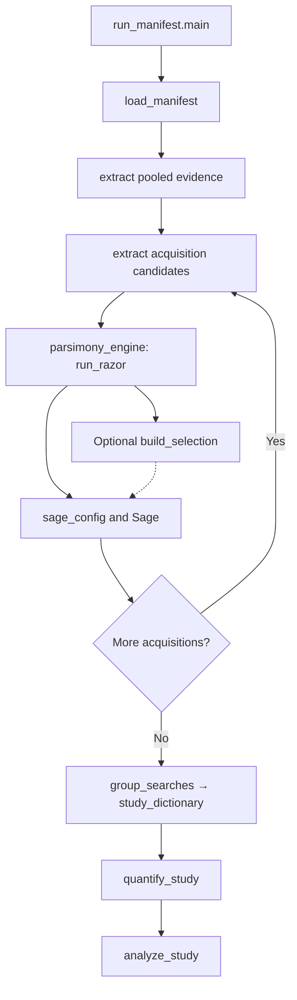

# Functions in execution order

Find a specific function in the [Python index](function-index.md),
[Python API](api/index.md) or [Rust index](rust-function-index.md).
The list below follows the default runner's execution order.

Start at [`run_manifest.main`](https://github.com/MannLabs/fasta-lake/blob/main/tools/run_manifest.py). Read its `execute`
calls from top to bottom; they connect the stages below. Python checks inputs,
organizes processes and records results; Rust performs sequence matching and
razor selection. [The method diagram](../concepts/principle.md) gives the scientific view.

## The main call path

## Before the run: prepare inputs

These are separate commands, used when needed. The study runner does not download
databases or run a de novo prediction model automatically.

| Task | Find this function | Result |
|---|---|---|
| Plan, download and unpack a reference | [`plan_download`, `download_resource`, `unpack_resource`](https://github.com/MannLabs/fasta-lake/blob/main/fasta_lake/downloads.py) | Checked local files and a download record |
| Curate downloaded protein FASTAs | [`lake_builder.main`](https://github.com/MannLabs/fasta-lake/blob/main/rust/fasta_extractor_v2/src/bin/lake_builder.rs) | Prepared reference and retained source headers; see the [download-to-study tutorial](../how-to/references.md) |
| Check existing DIANovo predictions | [`parse_dianovo_prediction`](https://github.com/MannLabs/fasta-lake/blob/main/fasta_lake/dianovo.py), [shared Rust parser](https://github.com/MannLabs/fasta-lake/blob/main/rust/common/dianovo.rs) | Complete peptides with zero-aware confidence; [input contract](../how-to/de-novo-inputs.md) |
| Prepare specimen-matched DNA/RNA inputs | [`prepare_source`](https://github.com/MannLabs/fasta-lake/blob/main/fasta_lake/multi_omics/sources.py) | `source.json`, verified tables and sequence-coverage ledger |

## During the run: actual call order

This is the default **augment** route. Each acquisition completes steps 4–7
before the next starts. Search parameters and optional annotation settings are
validated before output is created.

| Order | Function or executable | What to follow |
|---|---|---|
| 1. Plan resources | [`plan_laptop` → `detect_capacity`](https://github.com/MannLabs/fasta-lake/blob/main/fasta_lake/capacity.py), when `--laptop` is set | Visible RAM/CPU limits → thread and reference-piece plan |
| 2. Validate acquisitions | [`load_manifest`](https://github.com/MannLabs/fasta-lake/blob/main/tools/run_manifest.py), then [`load_reference`](https://github.com/MannLabs/fasta-lake/blob/main/fasta_lake/multi_omics/sources.py) for molecular rows | Resolve paths; check unique acquisition IDs, specimen identity and input hashes |
| 3. Pool de novo evidence | Runner's `extract("evidence", ...)` → [`extract_chunked`](https://github.com/MannLabs/fasta-lake/blob/main/fasta_lake/chunked.py) when chunking is selected | Match pooled predictions against the lake; merge pieces into `evidence.fasta` |
| 4. Draw an acquisition's candidates | Runner's `extract(sample + "_extract", ...)` | Match that acquisition's predictions against pooled evidence → `sample_lake.fasta` |
| 5. Select the compact database | [`parsimony_engine.main`](https://github.com/MannLabs/fasta-lake/blob/main/rust/parsimony_engine/src/main.rs) | Complete candidate set → razor FASTA with the recorded hash/accession tie rule |
| 6. Add matched molecular evidence | [`build_selection`](https://github.com/MannLabs/fasta-lake/blob/main/fasta_lake/multi_omics/selection.py), through `molecular add` | Preserve de novo targets; add exact DNA/RNA/compound-supported sequences → `molecular/search.fasta` |
| 7. Search the spectra | [`sage_config`](https://github.com/MannLabs/fasta-lake/blob/main/fasta_lake/search.py), then Sage | Final FASTA + mzML → `search/<sample>/config.json`, PSM and LFQ tables |
| 8. Write compatibility summaries | [`aggregation_engine.main`](https://github.com/MannLabs/fasta-lake/blob/main/rust/aggregation_engine/src/main.rs) | Member-set summaries under `aggregate/`; distinct from the fixed study matrix |
| 9. Fix study reporting groups | [`group_study.main`](https://github.com/MannLabs/fasta-lake/blob/main/tools/group_study.py) → [`group_searches` → `study_dictionary`](https://github.com/MannLabs/fasta-lake/blob/main/fasta_lake/study.py) | Accepted study peptides → deterministic dictionary, sum matrix, representatives and peptide evidence |
| 10. Quantify those groups | [`quantify_study`](https://github.com/MannLabs/fasta-lake/blob/main/fasta_lake/quantification.py) | Grouped ions → sum or directLFQ quantities; preserve missing cells and sample identity |
| 11. Make basic QC/PCA | [`analyze_study`](https://github.com/MannLabs/fasta-lake/blob/main/fasta_lake/downstream.py) | Selected matrix → coverage/missingness, AnnData and plots; record PCA eligibility |
| 12. Annotate, if requested | [`annotate_study` → `annotate_fasta`](https://github.com/MannLabs/fasta-lake/blob/main/fasta_lake/annotation.py) | Selected representatives → annotation and unresolved-sequence ledgers |

Both extraction routes call [`fasta_extractor.main`](https://github.com/MannLabs/fasta-lake/blob/main/rust/fasta_extractor_v2/src/main.rs).
Chunking preserves the global prediction ranking and merges evidence before
razor inference. In `--molecular-reference shared` mode, step 3 is omitted and
[`write_reference`](https://github.com/MannLabs/fasta-lake/blob/main/fasta_lake/multi_omics/sources.py) supplies the matched
specimen reference at step 4. Molecular additions still follow de novo selection.

The nested `execute` helper calls [`run_recorded`](https://github.com/MannLabs/fasta-lake/blob/main/fasta_lake/resources.py)
and appends `commands.json`. A failed command stops the run; the final
`COMPLETE.json` is written only after the requested stages finish.

## After the run: explicit extensions

| Question | Function | Output and scope |
|---|---|---|
| What did molecular additions gain or lose? | [`increment_report`, `reference_map`, `evidence_tables`](https://github.com/MannLabs/fasta-lake/blob/main/fasta_lake/multi_omics/increments.py) | Matched-search comparison with reference-wide peptide specificity |
| Which selected unknowns can be embedded? | [`embed_unknown`, `sequence_windows`](https://github.com/MannLabs/fasta-lake/blob/main/fasta_lake/embeddings.py) | Optional local ESM-C vectors covering all residues; embeddings do not assign function |
| What community does the peptide evidence support? | [prepare_unipept_queries → taxonomy_report](https://github.com/MannLabs/fasta-lake/blob/main/fasta_lake/taxonomy.py) | Native Unipept assignments → sunburst/treemap/tree and holobiont balance; [tutorial](../how-to/taxonomy.md) |
| How are peptides, proteins and function connected? | [export_evidence_network → render_ckg_network](https://github.com/MannLabs/fasta-lake/blob/main/fasta_lake/networks.py), [annotate_evidence_network](https://github.com/MannLabs/fasta-lake/blob/main/fasta_lake/network_annotations.py) | Complete memberships, exact eggNOG join and optional CKG view; [tutorial](../how-to/evidence-networks.md) |
| How does measured functional signal vary? | [`explore_study`](https://github.com/MannLabs/fasta-lake/blob/main/fasta_lake/exploration.py), [numeric transforms](https://github.com/MannLabs/fasta-lake/blob/main/fasta_lake/metaproteomics.py) | Experimental functional accounting and ordination with explicit missingness/design |

## Read a stage with its tests

Search by function name, or start with these pairs:

- Input integrity: [downloads](https://github.com/MannLabs/fasta-lake/blob/main/tests/test_downloads.py), molecular tests under [tests/](https://github.com/MannLabs/fasta-lake/tree/main/tests).
- Capacity and exact piece-boundary behavior: [capacity](https://github.com/MannLabs/fasta-lake/blob/main/tests/test_capacity.py), [chunking](https://github.com/MannLabs/fasta-lake/blob/main/tests/test_chunked.py).
- Search settings: [search options](https://github.com/MannLabs/fasta-lake/blob/main/tests/test_search_options.py).
- Quantification and QC: [quantification](https://github.com/MannLabs/fasta-lake/blob/main/tests/test_quantification.py), [downstream](https://github.com/MannLabs/fasta-lake/blob/main/tests/test_downstream.py).
- Added support and function: [increments](https://github.com/MannLabs/fasta-lake/blob/main/tests/test_molecular_increments.py), [annotation](https://github.com/MannLabs/fasta-lake/blob/main/tests/test_annotation.py), [experimental numeric transforms](https://github.com/MannLabs/fasta-lake/blob/main/tests/test_metaproteomics.py).

The [measured CAMPI example](https://github.com/MannLabs/fasta-lake/blob/main/examples/campi/run_example.py) connects the main
stages. The [multi-omics example](https://github.com/MannLabs/fasta-lake/blob/main/examples/multiomics/run_example.py) adds
explicitly synthetic molecular values to real sequences and spectra.
See [contributing](https://github.com/MannLabs/fasta-lake/blob/main/.github/CONTRIBUTING.md) for development/test commands and
[development priorities](../project/development.md) for work that remains.
